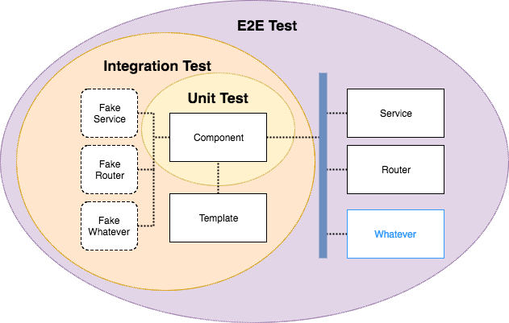

<!-- START doctoc generated TOC please keep comment here to allow auto update -->
<!-- DON'T EDIT THIS SECTION, INSTEAD RE-RUN doctoc TO UPDATE -->
**Table of Contents**  *generated with [DocToc](https://github.com/thlorenz/doctoc)*

- [Testing in Angular](#testing-in-angular)
  - [Introduction](#introduction)
  - [Setup](#setup)
  - [Angular CLI and its ingredients](#angular-cli-and-its-ingredients)
    - [Angular - JavaScript Framework](#angular---javascript-framework)
    - [RxJS - Reactive Extensions](#rxjs---reactive-extensions)
    - [Webpack - Bundle for JavaScript](#webpack---bundle-for-javascript)
    - [Jasmine - Unit & Integration Tests](#jasmine---unit--integration-tests)
    - [Protractor - End to end Testing for Angular](#protractor---end-to-end-testing-for-angular)
    - [Karma - Testrunner for JavaScript](#karma---testrunner-for-javascript)
    - [Istanbul - JavaScript Code Coverage Tool](#istanbul---javascript-code-coverage-tool)
    - [Linter (eslint, tslint,..)](#linter-eslint-tslint)
  - [Jasmine](#jasmine)
    - [Matchers](#matchers)
      - [nothing](#nothing)
      - [toBe](#tobe)
      - [toBeCloseTo](#tobecloseto)
      - [toBeDefined](#tobedefined)
      - [toBeFalsy](#tobefalsy)
      - [toBeGreaterThan](#tobegreaterthan)
      - [toBeGreaterThanOrEqual](#tobegreaterthanorequal)
      - [toBeLessThan](#tobelessthan)
      - [toBeLessThanOrEqual](#tobelessthanorequal)
      - [toBeNaN()](#tobenan)
      - [toBeNegativeInfinity()](#tobenegativeinfinity)
      - [toBeNull()](#tobenull)
      - [toBePositiveInfinity()](#tobepositiveinfinity)
      - [toBeTruthy()](#tobetruthy)
      - [toBeUndefined()](#tobeundefined)
      - [toContain](#tocontain)
      - [toEqual](#toequal)
      - [toHaveBeenCalled](#tohavebeencalled)
      - [toHaveBeenCalledBefore](#tohavebeencalledbefore)
      - [toHaveBeenCalledTimes](#tohavebeencalledtimes)
      - [toHaveBeenCalledWith](#tohavebeencalledwith)
      - [toMatch](#tomatch)
      - [toThrow](#tothrow)
      - [toThrowError](#tothrowerror)
    - [Spy](#spy)
      - [spyOn](#spyon)
      - [spyOnProperty](#spyonproperty)
      - [jasmine.createSpy](#jasminecreatespy)
      - [jasmine.createSpyObj](#jasminecreatespyobj)
    - [Spy#and](#spyand)
      - [callFake(fn)](#callfakefn)
      - [callThrough()](#callthrough)
      - [exec()](#exec)
      - [identity() → {String}](#identity-%E2%86%92-string)
      - [returnValue(value)](#returnvaluevalue)
      - [returnValues (...values)](#returnvalues-values)
      - [stub()](#stub)
      - [throwError(something)](#throwerrorsomething)
    - [Spy#calls](#spycalls)
      - [all() → {Array.<Spy.callData>}](#all-%E2%86%92-arrayspycalldata)
      - [allArgs() → {Array}](#allargs-%E2%86%92-array)
      - [any() → {Boolean}](#any-%E2%86%92-boolean)
      - [argsFor(index) → {Array}](#argsforindex-%E2%86%92-array)
      - [count() → {Integer}](#count-%E2%86%92-integer)
      - [first() → {ObjecSpy.callData}](#first-%E2%86%92-objecspycalldata)
      - [mostRecent() → {ObjecSpy.callData}](#mostrecent-%E2%86%92-objecspycalldata)
      - [reset()](#reset)
      - [saveArgumentsByValue()](#saveargumentsbyvalue)
    - [Classes](#classes)
      - [Clock](#clock)
        - [new Clock()](#new-clock)
        - [install() → {Clock}](#install-%E2%86%92-clock)
        - [mockDate(initialDate<sub>opt</sub>)](#mockdateinitialdatesuboptsub)
        - [tick(millis)](#tickmillis)
        - [uninstall()](#uninstall)
        - [withMock(Function)](#withmockfunction)
      - [Env()](#env)
        - [addReporter(reporterToAdd)](#addreporterreportertoadd)
      - [jsApiReporter](#jsapireporter)
        - [executionTime() → {Number}](#executiontime-%E2%86%92-number)
        - [specResults(index, length) → {Array.<SpecResult>}](#specresultsindex-length-%E2%86%92-arrayspecresult)
        - [specs() → {Array.<SpecResult>}](#specs-%E2%86%92-arrayspecresult)
        - [status() → {String}](#status-%E2%86%92-string)
        - [suiteResults(index, length) → {Array.<SuiteResult>}](#suiteresultsindex-length-%E2%86%92-arraysuiteresult)
        - [suites() → {Object}](#suites-%E2%86%92-object)
      - [Spy (see above)](#spy-see-above)
    - [Interfaces](#interfaces)
      - [Reporter](#reporter)
        - [jasmineDone(suiteInfo)](#jasminedonesuiteinfo)
        - [jasmineStarted(suiteInfo)](#jasminestartedsuiteinfo)
        - [specDone(result)](#specdoneresult)
        - [specStarted(result)](#specstartedresult)
        - [suiteDone(result)](#suitedoneresult)
        - [suiteStarted(result)](#suitestartedresult)

<!-- END doctoc generated TOC please keep comment here to allow auto update -->

# Testing in Angular 
`Last update: 2017-10-28`

## Introduction

## Setup
``` 
npm install -g @angular/cli
ng new ng-testing --routing
npm start
ng test
ng test --code-coverage
```

## Angular CLI and its ingredients 

Angular CLI (@angular/cli) is a CLI Tool for Angular Applications.

### Angular - JavaScript Framework
### [RxJS - Reactive Extensions] (https://github.com/Reactive-Extensions/RxJS)
### [Webpack - Bundle for JavaScript](https://webpack.js.org/)
### [Jasmine - Unit & Integration Tests](https://jasmine.github.io/)
### [Protractor - End to end Testing for Angular](http://www.protractortest.org/#/)
### [Karma - Testrunner for JavaScript](https://karma-runner.github.io/)
### Istanbul - JavaScript Code Coverage Tool
### Linter (eslint, tslint,..)

## Jasmine

```javascript
describe('suite title', function () {
    it('spec title', function () {
        // ...
    });
});
```

**Note:** `timeouts` in following table are optional.

| Global | Signature |Description  |
|:--|:--|:--|
|afterAll | `afterAll (function, timeout)` | Timeout in milliseconds. <br><br> **Be careful**, sharing the teardown from a afterAll makes it easy to accidentally **leak state** between your specs so that they erroneously pass or fail. |
|afterEach | `afterEach (function, timeout)` |  |
|beforeAll | `beforeAll (function, timeout)` | Same **danger**, see `afterAll above |
|beforeEach | `beforeEach (function, timeout) |  |
|describe | `describe(description, specDefinitions)` |  |
|expect | `expect(actual) → {matchers}` | See matchers in coming chapters |
|fail | fail(error) | Explicitly mark a spec as failed. |
|fdescribe | fdescribe(description, specDefinitions) | If suites or specs are focused, only those that are focused will be executed |
|fit | fit(description, testFunction, timeout) | focused, see `fdescribe` above |
|it | it(description, testFunction, timeout) |  |
|pending | pending(message) | Mark a spec as pending, expectation results will be ignored. |
|spyOn | spyOn(obj, methodName) → {Spy} | Install a spy onto an existing object. More details about says in coming chapters  |
|spyOnProperty | spyOnProperty(obj, propertyName, accessTypeopt) → {Spy} |  |
|xdescribe | xdescibe(description, specDefinitions) | temporarily disabled |
|xit|xit(description, testFunctionopt)|A temporarily disabled it|

### Matchers
#### nothing
`expect().nothing();` expect nothing explicitly.
#### toBe
`expect(thing).toBe(realThing);` expect the actual value to be === to the expected value
#### toBeCloseTo
`expect(12.34).toBeCloseTo(12.3, 1);` → success 
`expect(12.34).toBeCloseTo(12.3, 1);` → failure
#### toBeDefined
`expect(result).toBeDefined();` → Not undefined
#### toBeFalsy
expect(result).toBeFalsy();
#### toBeGreaterThan
`expect(result).toBeGreaterThan(3);`
#### toBeGreaterThanOrEqual
`expect(result).toBeGreaterThanOrEqual(25);`
#### toBeLessThan
`expect(result).toBeLessThan(0);`
#### toBeLessThanOrEqual
expect(result).toBeLessThanOrEqual(123);
#### toBeNaN()
#### toBeNegativeInfinity()
#### toBeNull()
#### toBePositiveInfinity()
#### toBeTruthy()
#### toBeUndefined()
#### toContain
`expect(array).toContain(anElement);`  → Array
`expect(string).toContain(substring);` → String

#### toEqual
expect the actual value to be equal to the expected, using **deep equality comparison**.

`expect(bigObject).toEqual({"foo": ['bar', 'baz']});`
#### toHaveBeenCalled
expect the actual (a Spy) to have been called.

`expect(mySpy).toHaveBeenCalled();` → called → succes
`expect(mySpy).not.toHaveBeenCalled();` → not called → success
#### toHaveBeenCalledBefore
expect the actual value (a Spy) to have been called before another Spy.

`expect(mySpy).toHaveBeenCalledBefore(otherSpy);`
#### toHaveBeenCalledTimes
`expect(mySpy).toHaveBeenCalledTimes(3);`
#### toHaveBeenCalledWith
expect the actual (a Spy) to have been called with particular arguments at least once.

`expect(mySpy).toHaveBeenCalledWith('foo', 'bar', 2);`
#### toMatch
expect the actual value to match a **regular expression**

`expect("my string").toMatch(/string$/);`

`expect("other string").toMatch("her");`

#### toThrow
expect a function to throw something.

`expect(function() { return 'things'; }).toThrow('foo');`

`expect(function() { return 'stuff'; }).toThrow();`
#### toThrowError
expect a function to throw an `Error`.

`toThrowError(expected, message);` Both parameters are optional. `message` is `RegExp` or `String.

`expect(function() { return 'things'; }).toThrowError(MyCustomError, 'message');`

`expect(function() { return 'things'; }).toThrowError(MyCustomError, /bar/);`

`expect(function() { return 'stuff'; }).toThrowError(MyCustomError);`

`expect(function() { return 'other'; }).toThrowError(/foo/);`

`expect(function() { return 'other'; }).toThrowError();`
### Spy
Do not use `spy()` directly, use the following:
#### spyOn
`spyOn(obj, methodName);` Install a spy onto an existing object. `methodName` is the name of the method to replace with a `Spy`.
#### spyOnProperty
`spyOnProperty(obj, propertyName, accessType)` 

EBIA: Would the following work? Test it,..

`spyOnProperty(someService, 'myValue', 'get').and.returnValue(false)`
#### jasmine.createSpy
`(static) createSpy(nameopt, originalFunction`<sub>opt</sub>`) → {Spy}`
#### jasmine.createSpyObj
Create an object with multiple Spys as its members.

`(static) createSpyObj(baseName`<sub>opt</sub>`, methodNames) → {Object}`

`methodNames` are either `Array<String>` or `Object
### Spy#and 
#### callFake(fn)
#### callThrough()
#### exec()
#### identity() → {String}
#### returnValue(value)
tell the spy to return the value when invoked
#### returnValues (...values)
Tell the spy to return one of the specified values (sequentially) each time the spy is invoked.
#### stub()
ell the spy to do nothing when invoked. This is the default.
#### throwError(something)
Tell the spy to throw an error when invoked.
### Spy#calls
#### all() → {Array.<Spy.callData>}
Get the raw calls array for this spy.
#### allArgs() → {Array}
Get all of the arguments for each invocation of this spy in the order they were received.
#### any() → {Boolean}
Check whether this spy has been invoked.
#### argsFor(index) → {Array}
Get the arguments that were passed to a specific invocation of this spy. (0-based invocation index)
#### count() → {Integer}
Get the number of invocations of this spy.
#### first() → {ObjecSpy.callData}
Get the first invocation of this spy.
#### mostRecent() → {ObjecSpy.callData}
Get the most recent invocation of this spy.
#### reset()
Reset this spy as if it has never been called.
#### saveArgumentsByValue()
Set this spy to do a shallow clone of arguments passed to each invocation.
### Classes
#### Clock
Jasmine's mock clock is used when testing time dependent code.
##### new Clock()
**Note:** Do not construct this directly, Jasmine will make one during booting. You can get the current clock with jasmine.clock.
##### install() → {Clock}
Install the mock clock over the built-in methods.
##### mockDate(initialDate<sub>opt</sub>)
Instruct the installed Clock to also mock the date returned by new Date()
##### tick(millis)
Tick the Clock forward, running any enqueued timeouts along the way
##### uninstall()
Uninstall the mock clock, returning the built-in methods to their places.
##### withMock(Function)
Execute a function with a mocked Clock. The clock will be **installed** before the function is called and **uninstalled** in a finally after the function completes.
#### Env()
The Jasmine environment.
new Env()
**Note:** Do not construct this directly, Jasmine will make one during booting.
##### addReporter(reporterToAdd)
Add a custom reporter to the Jasmine environment.
#### jsApiReporter
Reporter added by default in boot.js to record results for retrieval in javascript code. An instance is made available as jsApiReporter on the global object.
##### executionTime() → {Number}
Get the number of milliseconds it took for the full Jasmine suite to run.
##### specResults(index, length) → {Array.<SpecResult>}
Get the results for a set of specs.
Retrievable in slices for easier serialization.
##### specs() → {Array.<SpecResult>}
Get all spec results.
##### status() → {String}
Get the current status for the Jasmine environment, returns one of loaded, started, or done
##### suiteResults(index, length) → {Array.<SuiteResult>}
Get the results for a set of suites. Retrievable in slices for easier serialization.
##### suites() → {Object}
Get all of the suites in a single object, with their id as the key.
#### Spy (see above)
### Interfaces
#### Reporter
This represents the available reporter callback for an object passed to Env#addReporter.
##### jasmineDone(suiteInfo)
When the entire suite has finished execution jasmineDone is called
##### jasmineStarted(suiteInfo)
jasmineStarted is called after all of the specs have been loaded, but just before execution starts.
##### specDone(result)
specDone is invoked when an it and its associated beforeEach and afterEach functions have been run.

**Important!** While jasmine doesn't require any specific functions, not defining a specDone will make it impossible for a reporter to know when a spec has failed.
##### specStarted(result)
specStarted is invoked when an it starts to run (including associated beforeEach functions)
##### suiteDone(result)
suiteDone is invoked when all of the child specs and suites for a given suite have been run

**Important!** While jasmine doesn't require any specific functions, not defining a suiteDone will make it impossible for a reporter to know when a suite has failures in an afterAll.
##### suiteStarted(result)
suiteStarted is invoked when a describe starts to run


