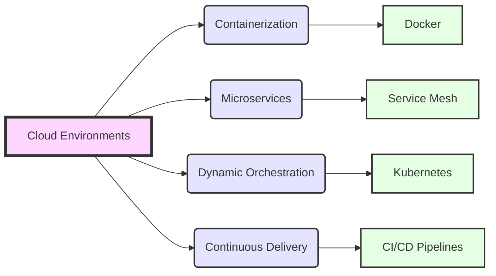

# Cloud Native

> Status: Under Construction - Brainstorming

<!-- @import "[TOC]" {cmd="toc" depthFrom=1 depthTo=6 orderedList=false} -->

<!-- code_chunk_output -->

- [Cloud Native](#cloud-native)
  - [Management Summary](#management-summary)
  - [Introduction](#introduction)
    - [Cloud Environments](#cloud-environments)
      - [Containerization (Docker)](#containerization-docker)
      - [Microservices (Service Mesh)](#microservices-service-mesh)
      - [Dynamic Orchestration (Kubernetes)](#dynamic-orchestration-kubernetes)
      - [Continuous Delivery (CI/CD Pipelines)](#continuous-delivery-cicd-pipelines)
    - [Setup](#setup)
      - [1\. Container Orchestration with Kubernetes](#container-orchestration-with-kubernetes)
      - [2\. Infrastructure as Code with Terraform](#infrastructure-as-code-with-terraform)
      - [3\. CI/CD Pipelines](#cicd-pipelines)
      - [4\. Microservices Architecture](#microservices-architecture)
      - [5\. Monitoring and Observability](#monitoring-and-observability)
      - [6\. Service Mesh](#service-mesh)
      - [7\. Storage and Databases](#storage-and-databases)
      - [8\. Security](#security)
    - [Deployment Workflow (Simplified):](#deployment-workflow-simplified)
      - [Develop and Test](#develop-and-test)
      - [Containerize](#containerize)
      - [CI/CD Pipeline](#cicd-pipeline)
      - [Monitor and Optimize](#monitor-and-optimize)

<!-- /code_chunk_output -->

## Management Summary

**CloudNative** refers to a set of practices and technologies used for developing and running scalable applications in modern, dynamic environments such as public, private, and hybrid clouds. Key characteristics include containerization, microservices, dynamic orchestration, and continuous delivery, allowing for faster development cycles, resilience, and manageability.

## Introduction

Below is a simplified Mermaid diagram that illustrates the core components of a CloudNative architecture:

This diagram showcases the relationship between cloud environments and the foundational elements of CloudNative architecture:

### Cloud Environments

The foundational layer where CloudNative applications are deployed, including public, private, and hybrid clouds.

#### Containerization (Docker)

Encapsulates the application and its dependencies in a container for consistency across development, testing, and production environments.

#### Microservices (Service Mesh)

Splits applications into smaller, interconnected services, improving modularity and making it easier to update and scale parts of the application independently.

#### Dynamic Orchestration (Kubernetes)

Manages the deployment and scaling of containerized applications, ensuring they run efficiently and resiliently across multiple servers.

#### Continuous Delivery (CI/CD Pipelines)

Automates the deployment process, allowing for frequent updates to applications with minimal manual intervention, enhancing agility and reducing time to market.

CloudNative architectures leverage these components to achieve high agility and efficiency in application development, deployment, and management.

### Setup

To align your setup with Cloud Native principles using Terraform and incorporating tools from the Cloud Native ecosystem, here's a plan to guide you through the process:

#### 1\. Container Orchestration with Kubernetes

- **Kubernetes Setup**: Deploy a Kubernetes cluster on your server or use a managed Kubernetes service from cloud providers. Kubernetes is a cornerstone of Cloud Native development, providing a robust platform for deploying, scaling, and managing containerized applications.

#### 2\. Infrastructure as Code with Terraform

- **Terraform Configuration**: Use Terraform to define the infrastructure for your Kubernetes cluster and any associated resources like load balancers, network policies, and persistent volumes. Terraform will be used to automate the deployment and management of your infrastructure in a Cloud Native manner.

#### 3\. CI/CD Pipelines

CI/CD: Continuous Integration/Continuous Deployment

- **CI/CD Pipeline**: Implement CI/CD pipelines using tools like GitHub Actions or GitLab CI/CD. The pipeline should automate testing, building, containerizing, and deploying your applications to the Kubernetes cluster. Incorporate Helm charts for package management and deployment to Kubernetes.

#### 4\. Microservices Architecture

- **Application Architecture**: Design your Angular and NestJS applications following microservices principles, ensuring they are loosely coupled, independently deployable, and scalable. This approach facilitates easier updates, scalability, and resilience.

#### 5\. Monitoring and Observability

- **Prometheus and Grafana**: Use Prometheus for monitoring and Grafana for visualization. Both integrate well with Kubernetes, providing insights into your applications' performance and health.

- **Logging**: Implement a centralized logging solution using Fluentd or a similar CNCF project, ensuring you can aggregate and analyze logs from all services and components.

#### 6\. Service Mesh

- **Istio or Linkerd**: Consider implementing a service mesh like Istio or Linkerd for advanced traffic management, security, and observability between your services. A service mesh adds a powerful layer of control and observability without changing the application code.

#### 7\. Storage and Databases

- **Persistent Storage**: Use Kubernetes persistent volumes and persistent volume claims for stateful application components, ensuring data persistence across pod restarts and deployments.

#### 8\. Security

- **Security Practices**: Incorporate security practices from the start, including container scanning, network policies in Kubernetes, and secure secrets management with tools like HashiCorp Vault.

### Deployment Workflow (Simplified):

#### Develop and Test

Develop and test your applications locally or in a development environment.

#### Containerize

Build Docker containers for each service.

#### CI/CD Pipeline

Push code changes to trigger the CI/CD pipeline, building, testing, and deploying your changes automatically to the Kubernetes cluster.

#### Monitor and Optimize

Use monitoring and logging tools to analyze performance and identify areas for improvement.

This setup emphasizes the core Cloud Native principles of automation, portability, scalability, and resilience. It leverages a range of CNCF projects and tools to create a flexible, scalable deployment pipeline and runtime environment for your applications.
