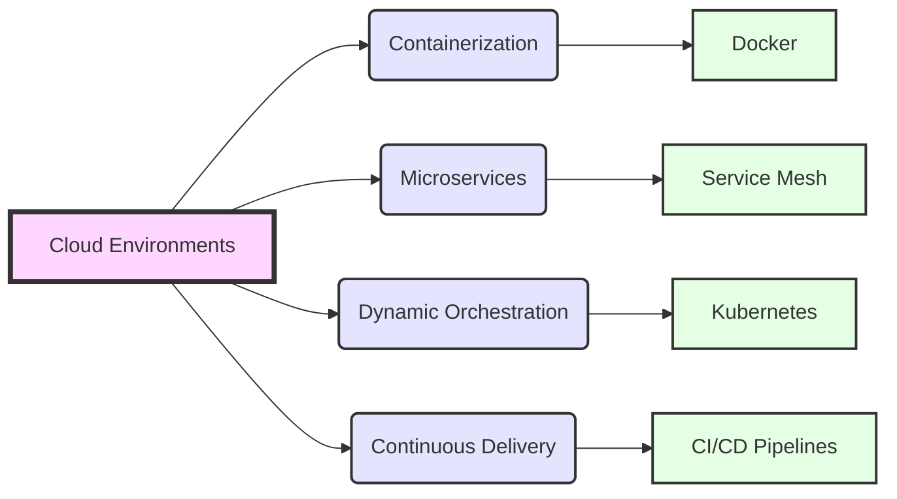

# Cloud Native

<!-- @import "[TOC]" {cmd="toc" depthFrom=1 depthTo=6 orderedList=false} -->

<!-- code_chunk_output -->

- [Cloud Native](#cloud-native)
  - [Introduction](#introduction)
    - [Cloud Environments](#cloud-environments)
    - [Containerization (Docker)](#containerization-docker)
    - [Microservices (Service Mesh)](#microservices-service-mesh)
    - [Dynamic Orchestration (Kubernetes)](#dynamic-orchestration-kubernetes)
    - [Continuous Delivery (CI/CD Pipelines)](#continuous-delivery-cicd-pipelines)

<!-- /code_chunk_output -->

## Introduction

CloudNative refers to a set of practices and technologies used for developing and running scalable applications in modern, dynamic environments such as public, private, and hybrid clouds. Key characteristics include containerization, microservices, dynamic orchestration, and continuous delivery, allowing for faster development cycles, resilience, and manageability.

Below is a simplified Mermaid diagram that illustrates the core components of a CloudNative architecture:

This diagram showcases the relationship between cloud environments and the foundational elements of CloudNative architecture:

### Cloud Environments

The foundational layer where CloudNative applications are deployed, including public, private, and hybrid clouds.

### Containerization (Docker)

Encapsulates the application and its dependencies in a container for consistency across development, testing, and production environments.

### Microservices (Service Mesh)

Splits applications into smaller, interconnected services, improving modularity and making it easier to update and scale parts of the application independently.

### Dynamic Orchestration (Kubernetes)

Manages the deployment and scaling of containerized applications, ensuring they run efficiently and resiliently across multiple servers.

### Continuous Delivery (CI/CD Pipelines)

Automates the deployment process, allowing for frequent updates to applications with minimal manual intervention, enhancing agility and reducing time to market.

CloudNative architectures leverage these components to achieve high agility and efficiency in application development, deployment, and management.
