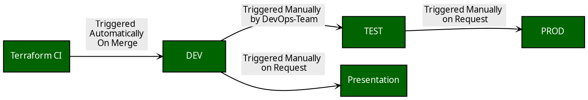

# Deployment Diagrams by Code

```graphviz
/**
 * @name: Target Staging Environment
 * @stages: dev, test, prod, presentation
 *
 * DIN A4 210mm x 297mm
 * Printable area: 190mm x 277mm
 * Graphviz default unit is inches.
 * 1 inch = 25.4 mm
 */
digraph G {
  // Graph attributes
  rankdir=LR;
  splines=curved;

  // Node attributes
  node [shape=box, width=1, height=0.5, color=black, fontcolor=white,
        fontsize=10, fillcolor="darkgreen", style=filled, fontname="Verdana"];

  // Edge attributes
  edge [fontcolor=black, fontsize=10, fontname="Trebuchet MS", color=black,
        arrowhead=vee, arrowsize=0.5, penwidth=1.0];

  // Nodes
  A [label="Terraform CI"]
  B [label="DEV"]
  C [label="TEST"]
  D [label="PROD"]
  E [label="Presentation"]

  // Edges
  A -> B [label=< <TABLE BORDER="0" CELLBORDER="0" CELLSPACING="0" >
    <TR><TD BGCOLOR="#ebebeb">Triggered <br/> Automatically <br/> On Merge</TD></TR>
      <TR><TD FIXEDSIZE="TRUE" HEIGHT="7"></TD></TR>
      </TABLE> >]
  B -> C [label=< <TABLE BORDER="0" CELLBORDER="0" CELLSPACING="0" >
    <TR><TD BGCOLOR="#ebebeb">Triggered Manually <br/> by DevOps-Team</TD></TR>
      <TR><TD FIXEDSIZE="TRUE" HEIGHT="7"></TD></TR>
    </TABLE> >]
  C -> D [label=<
    <TABLE BORDER="0" CELLBORDER="0" CELLSPACING="0" >
      <TR><TD BGCOLOR="#ebebeb">Triggered Manually <br/> on Request</TD></TR>
      <TR><TD FIXEDSIZE="TRUE" HEIGHT="7"></TD></TR>
    </TABLE> >]
  B -> E [label=<
    <TABLE BORDER="0" CELLBORDER="0" CELLSPACING="0" >
      <TR><TD BGCOLOR="#ebebeb">Triggered Manually <br/> on Request</TD></TR>
      <TR><TD FIXEDSIZE="TRUE" HEIGHT="7"></TD></TR>
    </TABLE> >]
}
```
