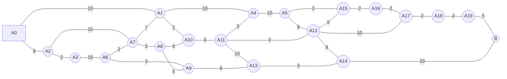
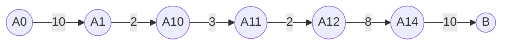

# Dijkstra

## Graph

```mermaid
graph LR
  A0 ---|10| A1((A1));
  A0 ---|8| A2((A2));
  A2 ---|2| A3((A3));
  A1 ---|10| A4((A4));
  A4 ---|10| A5((A5));
  A5 ---|8| A12((A12));
  A3 ---|10| A6((A6));
  A2 ---|10| A7((A7));
  A6 ---|2| A7((A7));
  A7 ---|7| A1((A1));
  A6 ---|3| A9((A9));
  A7 ---|2| A8((A8));
  A1 ---|2| A10((A10));
  A8 ---|5| A9((A9));
  A8 ---|5| A10((A10));
  A10 ---|3| A11((A11));
  A11 ---|10| A13((A13));
  A9 ---|8| A13((A13));
  A11 ---|3| A4((A4));
  A11 ---|2| A12((A12));
  A12 ---|8| A14((A14));
  A13 ---|3| A14((A14));
  A5 ---|2| A15((A15));
  A12 ---|5| A15((A15));
  A15 ---|2| A16((A16));
  A16 ---|2| A17((A17));
  A12 ---|10| A17((A17));
  A17 ---|2| A18((A18));
  A18 ---|2| A19((A19));
  A19 ---|5| B((B));
  A14 ---|10| B((B));
```

## Solution

```mermaid
graph LR
  A0((A0)) -->|10| A1((A1));
  A1 -->|2| A10((A10));
  A10 -->|3| A11((A11));
  A11 -->|2| A12((A12));
  A12 -->|8| A14((A14));
  A14 -->|10| B((B));

```
