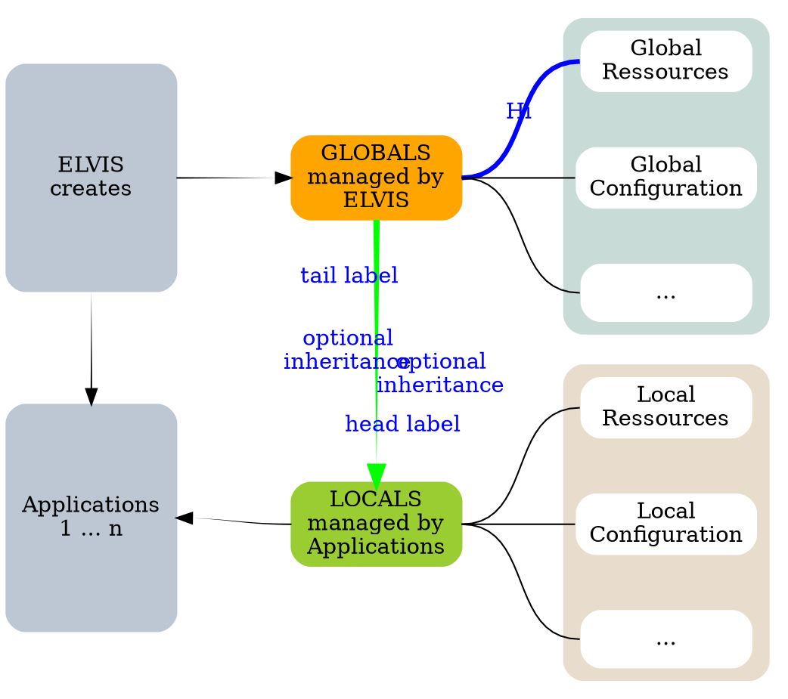

# Dot Examples

## Simple Explanation of Nx Mono-Repo

```graphviz
digraph {
  rankdir=LR;
  nodesep=0.5;
  ranksep=1;
  edge [splines=false labelfloat=true labeldistance=2.5 fontsize=14 fontcolor=blue style="tapered"];
  layout="dot";


  subgraph all {
    subgraph cluster_global {

      edge [dir=none];
      node [shape=box, width=1.5, height=0.5, style="filled, rounded", bgcolor="#ffffff", color="white"]
      style="filled, rounded"
      bgcolor="#c9dbd7"
      color="#c9dbd7"
      height=3
      width=3
      node [label="Global\nRessources"] g_resources
      node [label="Global\nConfiguration"] g_configuration
      node [label="..."] g_whatever
      node [label="GLOBALS\nmanaged by\nELVIS" color="orange" ] globals;
    }

    subgraph cluster_local {
      edge [dir=none style="tapered" ];
      node [shape=box, width=1.5, height=0.5, style="filled, rounded", bgcolor="#ffffff", color="white"]
      labelloc="b"
      style="filled, rounded"
      bgcolor="#e8ddcc"
      color="#e8ddcc"
      height=3
      width=3
      node [label="Local\nRessources"] l_resources
      node [label="Local\nConfiguration"] l_configuration
      node [label="..."] l_whatever
      node [label="LOCALS\nmanaged by\nApplications" color="yellowgreen" ] locals;
    }

    node [shape=box, width=1.5, height=2, style="filled, rounded", color="#bcc7d3" bgcolor="#bcc7d3" label="Applications\n1 ... n"] app

    node [shape=box, label="ELVIS\ncreates"] ELVIS

    globals -> g_resources [tailport=e, headport=w, dir=none color="blue" penwidth=3.0 style="tapered" label="Hi" ];
    globals -> g_configuration [tailport=e, headport=w, dir=none ];
    globals -> g_whatever [tailport=e, headport=w, dir=none ];

    locals -> l_resources [tailport=e, headport=w dir=none ];
    locals -> l_configuration [tailport=e, headport=w dir=none ];
    locals -> l_whatever [tailport=e, headport=w dir=none ];


    ELVIS -> globals [tailport=e, headport=w  ];
    globals -> locals [ label="optional\ninheritance"  constraint=false, color="green", headlabel="head label" taillabel="tail label"  labeldistance="4.0" labelfloat=true penwidth=4.0 xlabel="optional\ninheritance"];


    { rank = same; ELVIS; app; }
    { rank = same; globals; locals; }

    ELVIS -> app [tailport=s, headport=n,  ];
    locals -> app [tailport=w, headport=e constraint=false];

  }
}

```

## Ein anderes Beispiel

```graphviz


digraph {

}
```
