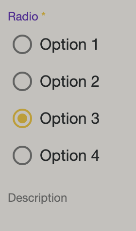

# Styling Formly

## Radio (Options)

<figure></figure>

```ts
 fields: FormlyFieldConfig[] = [
    {
      key: 'Radio',
      type: 'radio',
      defaultValue: 3,
      templateOptions: {
        label: 'Radio',
        placeholder: 'Placeholder',
        description: 'Description',
        required: true,
        options: [
          { value: 1, label: 'Option 1' },
          { value: 2, label: 'Option 2' },
          { value: 3, label: 'Option 3' },
          { value: 4, label: 'Option 4' },
        ],
      },
    },
  ];
```

```html
<form [formGroup]="form">
  <formly-form
    [model]="model"
    [fields]="fields"
    [options]="options"
    [form]="form"
  >
  </formly-form>
</form>
```

```css
formly-field-mat-radio {
  .mat-radio-group {
    display: inline-flex;
    flex-direction: column;
  }

  .mat-radio-button {
    margin: 5px;
  }
}
```

## Checkbox (Multi, Options)

```ts
  fields: FormlyFieldConfig[] = [
    {
      key: 'multicheckbox',
      type: 'multicheckbox',
      templateOptions: {
        label: 'multicheckbox',
        required: true,
        disabled: true,
        options: [
          { label: 'Option 1', value: '1' },
          { label: 'Option 2', value: '2' },
          { label: 'Option 3', value: '3' },
        ],
      },
    },
  ];
```
