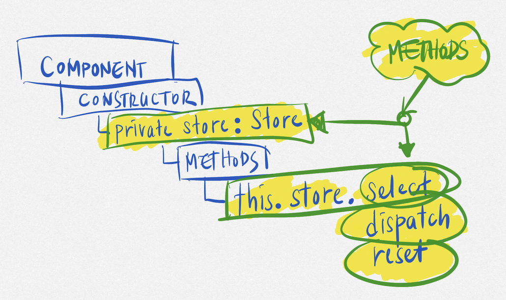

# NGXS - Experts only

> Beginners guide here: [NGXS/Documentation/Basics/ReadMe.md](../Basics/ReadMe.md)

This document serves to reiterate the format and aims to facilitate a smooth return to the subject matter at hand.

**Important:** Every other part except "best-practice" is for information purposes only (it helps to understand code examples online, but it is not recommended to use them, unless the "best-practice" part includes it).

<figure>
  
  <figcaption>Store Select</figcaption>
</figure>

<!-- @import "[TOC]" {cmd="toc" depthFrom=2 depthTo=6 orderedList=false} -->

<!-- code_chunk_output -->

- [Keywords- Quick remembrance](#keywords--quick-remembrance)
  - [Store (private store: Store)](#store-private-store-store)
    - [select/dispatch Methods & Decorators (e.g. this.store.select)](#selectdispatch-methods--decorators-eg-thisstoreselect)
  - [@State](#state)
  - [StateContext: Ctx](#statecontext-ctx)
  - [Action: @Action](#action-action)
  - [Actions](#actions)
    - [Namespace](#namespace)
    - [Class with static readonly type & optional constructor](#class-with-static-readonly-type--optional-constructor)
  - [@Select](#select)
  - [Selector (Selector Utils)](#selector-selector-utils)
    - [createPropertySelectors](#createpropertyselectors)
    - [createModelSelector](#createmodelselector)
    - [createPickSelector](#createpickselector)
  - [Dispatch: @Dispatch](#dispatch-dispatch)
- [Setup &rarr; Best Practice &rarr; NxMonorepo](#setup-rarr-best-practice-rarr-nxmonorepo)
  - [Step 1: Create a new library](#step-1-create-a-new-library)
  - [Step 2: Install the packages](#step-2-install-the-packages)
    - [Core Package](#core-package)
    - [Additional Packages](#additional-packages)
    - [Labs Packages](#labs-packages)
  - [Step 3: Set `RootStoreModule.forRoot()` in the `CustomStoreModule`:](#step-3-set-rootstoremoduleforroot-in-the-customstoremodule)
  - [Step 4: Use it in a new App: `NgxsModule.forFeature`](#step-4-use-it-in-a-new-app-ngxsmoduleforfeature)
    - [Step 4.1 Create a new `store` folder in the App](#step-41-create-a-new-store-folder-in-the-app)
    - [Step 4.2 Create a new file `app-root.model.ts`](#step-42-create-a-new-file-app-rootmodelts)
    - [Step 4.3 Create a new file `app-root.actions.ts`](#step-43-create-a-new-file-app-rootactionsts)
    - [Step 4.4 Create a new file `app-root.state.ts`](#step-44-create-a-new-file-app-rootstatets)
    - [Step 4.5 Update the `AppModule` of the selected App](#step-45-update-the-appmodule-of-the-selected-app)
  - [Step 5: Install Browser Extension: Redux DevTools](#step-5-install-browser-extension-redux-devtools)
  - [Step 6: Check in the Browser: Redux DevTools](#step-6-check-in-the-browser-redux-devtools)

<!-- /code_chunk_output -->

## Keywords- Quick remembrance

### Store (private store: Store)

You can inject the store in the component or in the service. You have to import the `Store` from `@ngxs/store`:

```ts
import { Store } from '@ngxs/store';
```

```ts
constructor(private store: Store) {}
```

Then you can use its methods e.g.:

```ts
this.store.select(...); // params: selector, e.g. LanguageState.getLanguage
this.store.selectSnapshot(...); // params: selector, e.g. LanguageState.getLanguage
this.store.dispatch(...); // params: action, e.g. new LanguageActions.SetLanguage(lang)
this.store.reset(...); // params: state, e.g. LanguageDefaultState
```

The better approach would be (When it pays off &rarr; needs to be verified for each use case) to create a service and use the `@Select` (reading) and `@Dispatch` (modifying) decorators, like:

#### select/dispatch Methods & Decorators (e.g. this.store.select)

```ts
import { Select, Dispatch } from '@ngxs-labs/dispatch-decorator';
```

```ts
/**
 * e.g. the Service name is: `LanguageService`
 * and the State name is: `LanguageState`
 */
@Select(LanguageState.getLanguage) lang$: Observable<Lang>;
@Dispatch() setLanguage = (lang: Lang) => new LanguageState.SetLanguage(lang);
```

If you inject this service in the component like:

```ts
constructor(private languageService: LanguageService) {}

// ...  later in the code in a method
// Lang enum is imported from the app-types

// Select the language
this.languageService.lang$.subscribe((lang: Lang) => {
  console.log('lang', lang);
});


// Set the language
this.languageService.setLanguage(Lang.de);
```

### @State

It will be used in different contexts, if you use it as decorator e.g.:

```ts
import { State } from '@ngxs/store';
```

```ts
@State<AppRootStoreModel>({
  name: APP_ROOT_STATE_TOKEN, // <- the name of the state
  defaults: AppRootDefaultState, // <- the default state
})
export class AppRootState {

  // use @Selectors here (before the constructor)

  /**
   * The constructor is optional and can be used as
   * a hook to initialize the state, e.g.:
   *
   *    this.store.dispatch(new SomeUsefulAction(
   *      someData: SomeDataType)
   *    );
   *
   * or to reset the state, e.g.:
   *
   *    this.store.reset({ ... });
   *
   * Is dispatching an action within a State Constructor a good practice?
   *
   * I don't think so, because there are other ways to
   * achieve the same result, like:
   *
   * - using the `ngxsOnInit` function, which is called when the
   *   state is initialized.
   *
   * - or simply use a default state, within
   *   the `@State` decorator.
   *
   * If you want to use `ngxsOnInit` at all costs, you have to implement
   * the `OnInit` interface, e.g.:
   *
   * `export class AppRootState implements OnInit { ... }`
   *
   * and then implement the `ngxsOnInit` function, e.g.:
   *
   * `ngxsOnInit(ctx: StateContext<AppRootStoreModel>) { ... }`
   */

  constructor() {}

  // use @Actions here (after the constructor)

}
```

or you use it as a function e.g.:

```ts
import { State } from '@ngxs/store';
```

```ts

/**
 * NOT RECOMMENDED, BUT POSSIBLE!
 * Use better the construct above and not the one below.
 */

export function AppRootState() {
  return <T extends StateContext<AppRootStoreModel>>(target: T) => {
    target.prototype.ngxsOnInit = function(ctx: T) {
      // ...
    };
  };
}
```

### StateContext: Ctx

It will be used within Actions, see the next chapter. Ctx is the same as StateContext, will be imported and renamed as Ctx:

```ts
import { StateContext as Ctx } from '@ngxs/store';
```

It is an abbreviation and used in many online examples and courses. I find it personally unnecessary and irritating. Use better the full name `StateContext`.

### Action: @Action

> See `@State`-Section below for the whole construct.

Do not confuse the `@Action` decorator with the `Actions` class, which is placed within a namespace. In the Actions class you have to define all the actions of the current app. You give them a name and a type. The type is used in the `@Action` decorator. (See Actions section below &rarr; next chapter)

The `@Action` decorator is used within the State class (decorated itself with `@State`) to implement the actions of the current state. You have to import the `Action` decorator from `@ngxs/store`.

```ts
import { Action } from '@ngxs/store';
```

then within the State class (after the constructor &rarr; agreement &rarr; Coding Style Guides) you can use it like:

```ts
/**
 * DECIDE FOR ONE OF THE FOLLOWING WAYS:
 */

@Action(LanguageActions.SetLanguage)
setLanguage(
  ctx: StateContext<AppRootStoreModel>,
  action: LanguageActions.SetLanguage
  ) {
  ctx.patchState({ lang: action.lang });
}
```

or

```ts
/**
 * PREFFERED WAY (My Choice)
 */
@Action(LanguageActions.SetLanguage)
setLanguage(
  { patchState }: StateContext<AppRootStoreModel>,
  { lang }: LanguageActions.SetLanguage
) {
  patchState({ lang });
}
```

or

```ts
/**
 * setState updates the entire state object.
 * Use it only if you want to replace the entire state.
 * If not use patchState.
 */
@Action(LanguageActions.SetLanguage)
setLanguage(
  { setState }: StateContext<AppRootStoreModel>,
  { lang }: LanguageActions.SetLanguage) {
  setState({ lang });
}
```

or

```ts
@Action(LanguageActions.SetLanguage)
setLanguage(

/**
 * NOT RECOMMENDED,
 * But used in my online examples and courses.
 * Ctx is the same as StateContext, will be imported
 * and renamed as Ctx:
 * import { StateContext as Ctx } from '@ngxs/store';
 * I find it personally irritating, but you be used to it.
 */

  { setState }: Ctx,
  { lang }: LanguageActions.SetLanguage) {
  setState({ lang });
}
```

### Actions

Create a namespace to group the actions of a state. Ignore the eslint rule `@typescript-eslint/no-namespace` and deactivate it in the `.eslintrc.json` file:

```json
"@typescript-eslint/no-namespace": "off",
```

Reason: Everything is TypeScript and no need to avoid namespaces; on the contrary, they are very useful. (Personal Opinion: This is a unnecessary conflict between TypeScript and JavaScript at the time of writing this document.)

#### Namespace

```ts
export namespace <GiveItAPropername>Actions {
  /**
   * Here we have all the actions
   * of "<GiveItAPropername>Actions" as static classes
   */
}
```

#### Class with static readonly type & optional constructor

```ts
export namespace LanguageActions {
  export class SetLanguage {
    static readonly type = '[Language Actions] Set Language';
    constructor(public lang: Lang) {}
  }
}
```

### @Select

> **Important:**
> select (active) -> selects -> a selector (passiv)
> `@Select` is the decorator and it `selects` a selector, do not confuse with Selector Utils, which are decorated with `@Selector` and create selectors, see next chapter. (Really confusing, I know.)
> **I have to remember everytime, if I change back and forth between NGXS and other state management libraries.**

It can be used in the component or in the service, either via a getter or via a function, or via a property. You have to import the `Select` decorator from `@ngxs/store`:

```ts
import { Select } from '@ngxs/store';
```

```ts
@Select(LanguageState.getLanguage) lang$: Observable<Lang>; // <- function
@Select(LanguageState.language) lang$: Observable<Lang>; // <- getter
@Select(LanguageState.lang) lang$: Observable<Lang>; // <- property
```

### Selector (Selector Utils)

Further details online: <https://www.ngxs.io/advanced/selector-utils>

Do not confuse with the `@Select` decorator, which is a kind of alias for `this.store.select`. **Selector Utils** are a set of functions that can be used to create selectors.

You have to import the `Selector` from `@ngxs/store`:

```ts
import { Selector } from '@ngxs/store';
```

```ts
@Selector([LanguageState]) // <- the state
static getLanguage(state: LanguageStateModel) {
  return state.lang;
}
```

Selectors are one of the most powerful features in NGXS. When used in a correct way they are very performant due to the built-in memoization.

These are the provided utils:

#### createPropertySelectors

create a selector for each property of an object returned by a selector.

```ts
export const { getLanguage } = createPropertySelectors(LanguageState);
```

#### createModelSelector

create a selector that returns an object which is composed from values returned by multiple selectors.

```ts
export const getLanguageModel = createModelSelector(LanguageState, {
  lang: getLanguage,
});
```

#### createPickSelector

create a selector that returns a subset of an object's properties, and changes only when those properties change.

```ts
export const getLanguagePick = createPickSelector(getLanguageModel, ['lang']);
```

### Dispatch: @Dispatch

It can be used in the component or in the service (anywhere in the app). You have to import the `Dispatch` decorator from `@ngxs-labs/dispatch-decorator`:

```ts
import { Dispatch } from '@ngxs-labs/dispatch-decorator';
```

```ts
@Dispatch() setLanguage = (lang: Lang) => new <NameSpace>.SetLanguage(lang);
```

## Setup &rarr; Best Practice &rarr; NxMonorepo

### Step 1: Create a new library

```shell
ng g lib custom-store --directory=<relativ-path>
```

### Step 2: Install the packages

#### Core Package

```shell
npm install @ngxs/store --save
```

#### Additional Packages

Install them all (except `immer-adapter`), we will use another technique.

```shell
npm install @ngxs-labs/dispatch-decorator --save
npm install @ngxs/devtools-plugin --save-dev
npm install @ngxs/form-plugin --save
npm install @ngxs-labs/immer-adapter --save # not needed
npm install @ngxs/logger-plugin --save-dev
npm install @ngxs/router-plugin --save
npm install @ngxs/storage-plugin --save
npm install @ngxs/websocket-plugin --save
```

#### Labs Packages

Re-Check the list and install the packages you need.

```shell
npm install @ngxs-labs/data --save
npm install ​@ngxs-labs/entity-state --save
npm install @ngxs-labs/data --save
npm install @ngxs-labs/emitter --save
npm install @ngxs-labs/immer-adapter --save
npm install @ngxs-labs/dispatch-decorator --save
npm install @ngxs-labs/select-snapshot --save
npm install @ngxs-labs/async-storage-plugin --save
npm install @ngxs-labs/entity-state --save
npm install @ngxs-labs/actions-executing --save
npm install @ngxs-labs/firestore-plugin --save # not needed
```

### Step 3: Set `RootStoreModule.forRoot()` in the `CustomStoreModule`:

```typescript
import { NgModule } from '@angular/core';
import { CommonModule } from '@angular/common';
import { NgxsModule } from '@ngxs/store';
import { NgxsLoggerPluginModule } from '@ngxs/logger-plugin';
import { NgxsReduxDevtoolsPluginModule } from '@ngxs/devtools-plugin';
import { NgxsRouterPluginModule } from '@ngxs/router-plugin';
import { NgxsFormPluginModule } from '@ngxs/form-plugin';
import { NgxsStoragePluginModule } from '@ngxs/storage-plugin';
import { NgxsDispatchPluginModule } from '@ngxs-labs/dispatch-decorator';

@NgModule({
  imports: [
    CommonModule,
    NgxsModule.forRoot(
      [], // <- Empty Root State
      {
        developmentMode: !environment.production, // Changed in Nx v16+
      }
    ),
    NgxsLoggerPluginModule.forRoot(),
    NgxsReduxDevtoolsPluginModule.forRoot(),
    NgxsRouterPluginModule.forRoot(),
    NgxsFormPluginModule.forRoot(),
    NgxsStoragePluginModule.forRoot(),
    NgxsDispatchPluginModule.forRoot(),
  ],
  exports: [NgxsModule, NgxsLoggerPluginModule, NgxsReduxDevtoolsPluginModule],
})
export class CustomStoreModule {}
```

### Step 4: Use it in a new App: `NgxsModule.forFeature`

#### Step 4.1 Create a new `store` folder in the App

E.g. `apps/frontend/<my-app-fe>/src/app/store`

And create following files in the `store` folder:

#### Step 4.2 Create a new file `app-root.model.ts`

```ts
import { StateToken } from '@ngxs/store';

export enum Lang {

 /**
  * Get From App Types.
  * Here only for demo purpose.
  */

  de = 'de',
  en = 'en',
  fr = 'fr',
}

export const APP_ROOT_STATE_TOKEN = new StateToken<AppRootStoreModel>(
  /**
   * This is the name of the root state
   * of the current app
   */
  'appRoot',
);

export type AppRootStoreModel = {

  /**
   * A simple Type for demo purposes
   * for the root state of the current app
   */

  [key: string]: any;
  lang: Lang;
};

export const AppRootDefaultState: AppRootStoreModel = {
  lang: Lang.de,
};

```

#### Step 4.3 Create a new file `app-root.actions.ts`

```ts
import { Lang } from '<app-types>';

export namespace AppRootActions {

/**
 * Even if VSCode/Eslint complains about the
 * namespaces, ignore it and deactivate better the
 * rule in the `.eslintrc.json` file:
 *
    "@typescript-eslint/no-namespace": "off",
 *
 * Everything is TypeScript and no need to
 * avoid namespaces; on the contrary, they
 * are very useful.
 *
 * We do not really need GetLanguage, if we
 * use the `@Select` decorator. But for the sake
 * of completeness, I add it here.
 */

  export class SetLanguage {
    static readonly type = '[<My-App-Name> App] Set Language';
    constructor(public lang: Lang) {}
  }

  export class GetLanguage {
    static readonly type = '[<My-App-Name> App] Get Language';
  }
}
```

#### Step 4.4 Create a new file `app-root.state.ts`

#### Step 4.5 Update the `AppModule` of the selected App

That would be the `AppModule` in the `apps` folder of the selected App in the NxMonorepo

(Notice: **forFeature**, because the NxSharedLib has already the **forRoot** )

```typescript
import { NgModule } from '@angular/core';
import { CommonModule } from '@angular/common';
import { CustomStoreModule } from '@custom-store/custom-store.module';
import { NgxsModule } from '@ngxs/store';

@NgModule({
  imports: [
    CommonModule,
    CustomStoreModule,
    NgxsModule.forFeature([AppRootState]), // <- forFeature
  ],
})
export class AppModule {}
```

### Step 5: Install Browser Extension: Redux DevTools

- [>> Redux DevTools for Chrome](https://chrome.google.com/webstore/detail/redux-devtools/lmhkpmbekcpmknklioeibfkpmmfibljd)

- [>> Redux DevTools for Firefox](https://addons.mozilla.org/en-US/firefox/addon/reduxdevtools/)

- [>> Redux DevTools for Edge](https://microsoftedge.microsoft.com/addons/detail/redux-devtools/)

- [>> Redux DevTools for Opera](https://addons.opera.com/en/extensions/details/redux-devtools/)

### Step 6: Check in the Browser: Redux DevTools


