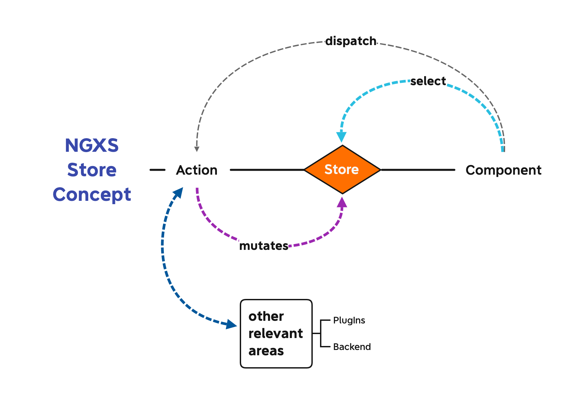

# NGXS

<!-- @import "[TOC]" {cmd="toc" depthFrom=1 depthTo=6 orderedList=false} -->

<!-- code_chunk_output -->

- [NGXS](#ngxs)
  - [What is NGXS](#what-is-ngxs)
    - [CQRS - Command Query Responsibility Segregation](#cqrs-command-query-responsibility-segregation)
  - [Installation](#installation)
    - [Development Tools & PlugIns](#development-tools-plugins)
      - [Package.json Dependencies](#packagejson-dependencies)
  - [Concepts](#concepts)
    - [Store](#store)
    - [State](#state)
    - [Selects](#selects)
    - [Actions](#actions)
  - [Store](#store-1)
    - [Snapshots](#snapshots)
  - [State](#state-1)
    - [(Optional) Defining State Token](#optional-defining-state-token)
    - [Reset](#reset)
  - [Select](#select)
    - [Select Decorators](#select-decorators)
    - [Store Select Function](#store-select-function)
    - [Snapshot Selects](#snapshot-selects)
    - [Memoized Selectors](#memoized-selectors)
      - [Selector Options](#selector-options)
        - [`suppressErrors`](#suppresserrors)
        - [`injectContainerState`](#injectcontainerstate)
      - [Memoized Selectors with Arguments](#memoized-selectors-with-arguments)
        - [Lazy Selectors](#lazy-selectors)
        - [Dynamic Selectors](#dynamic-selectors)
      - [Joining Selectors](#joining-selectors)
      - [Meta Selectors](#meta-selectors)
      - [The Order of Interacting Selectors](#the-order-of-interacting-selectors)
      - [Inheriting Selectors](#inheriting-selectors)
  - [Actions](#actions-1)
    - [Naming Conventions](#naming-conventions)
      - [Actions taking place in the future](#actions-taking-place-in-the-future)
      - [Actions as Reaction of Events (already triggered)](#actions-as-reaction-of-events-already-triggered)
    - [Creating Actions](#creating-actions)
      - [Actions with Metadata](#actions-with-metadata)
    - [Grouping Actions](#grouping-actions)
    - [Dispatching Actions](#dispatching-actions)
    - [Dispatching Multiple Actions](#dispatching-multiple-actions)
    - [Dispatching & Observables](#dispatching-observables)
      - [Reseting a form after dispatching - I](#reseting-a-form-after-dispatching-i)
      - [Reseting a form - II - getting state](#reseting-a-form-ii-getting-state)

<!-- /code_chunk_output -->

## What is NGXS

[>> Source & Website](https://www.ngxs.io/)

**NGXS** is a state management pattern + library for Angular. It acts as a **single source of truth** for your application's state, providing simple rules for **predictable state mutations**.

NGXS is modeled after the **CQRS pattern** popularly implemented in libraries like _Redux_ and _NgRx_ but reduces boilerplate by using modern **TypeScript** features such as **classes** and **decorators**.

### CQRS - Command Query Responsibility Segregation

It's very useful to separate methods into those that change state (commands) and those that don't (queries).

> Because the term **command** is widely used in other contexts I prefer to refer to them as **modifiers**, you also see the term **mutators**.
>
> _\- Martin Fowler_

Non-state changing methods, can be used in any context without worrying about how they sequence with other methods. You have to be more careful with modifiers.

Further Reading & Related Topics:

- <https://martinfowler.com/bliki/CQRS.html>
- <https://martinfowler.com/bliki/CommandQuerySeparation.html>
- <https://martinfowler.com/bliki/BoundedContext.html>
- <https://martinfowler.com/bliki/ObservableState.html>

## Installation

```shell
npm install @ngxs/store --save
```

then in **app.module.ts**, import the **NgxsModule**:

```ts
import { NgModule } from '@angular/core';
import { BrowserModule } from '@angular/platform-browser';
import { NgxsModule } from '@ngxs/store';
import { environment } from './../environments/environment';

import { AppComponent } from './app.component';

@NgModule({
  declarations: [AppComponent],
  imports: [
    BrowserModule,
    NgxsModule.forRoot(
      [], // <-- INITIAL STATE
      {
        developmentMode: !environment.production,
      },
    ),
  ],
  providers: [],
  bootstrap: [AppComponent],
})
export class AppModule {}
```

### Development Tools & PlugIns

```ts
// excerpt e.g. app.module.ts, some of them
NgxsRouterPluginModule.forRoot(),
NgxsFormPluginModule.forRoot(),
NgxsStoragePluginModule.forRoot(),
NgxsReduxDevtoolsPluginModule.forRoot(),
NgxsDispatchPluginModule.forRoot(),
```

#### Package.json Dependencies

```shell
"@ngx-formly/core": "^5.0.0",
"@ngx-formly/material": "^5.0.0",
"@ngx-translate/core": "^13.0.0",
"@ngx-translate/http-loader": "^6.0.0",
"@ngxs-labs/dispatch-decorator": "^2.1.1",
"@ngxs-labs/immer-adapter": "^3.0.5",
"@ngxs/devtools-plugin": "^3.7.2",
"@ngxs/form-plugin": "^3.7.2",
"@ngxs/logger-plugin": "^3.7.2",
"@ngxs/router-plugin": "^3.7.2",
"@ngxs/storage-plugin": "^3.7.2",
"@ngxs/store": "^3.7.2",
```

## Concepts

Sources:

- <https://www.ngxs.io/concepts/intro>



There are 4 major concepts to NGXS:

### Store

Global state container, action dispatcher and selector

### State

Class definition of the state

### Selects

State slice selectors

### Actions

Class describing the action to take and its associated metadata

## Store

The **store** is a **global state manager** that **dispatches actions** your state containers listen to and provides a way to select data slices out from the global state.

### Snapshots

You can get a snapshot of the state by calling `store.snapshot()`. This will return the entire value of the store for that point in time.

## State

States are classes along with decorators to describe metadata
and action mappings. To define a state container, let's create an
ES2015 class and decorate it with the `State` decorator.

```ts
import { Injectable } from '@angular/core';
import { State } from '@ngxs/store';

@State<string[]>({
  name: 'animals',
  defaults: [],
})
@Injectable()
export class AnimalsState {}
```

In the state decorator, we define some metadata about the state. These options
include:

- `name`: The name of the state slice. Note: The name is a required parameter and must be unique for the entire application.
  Names must be object property safe, (e.g. no dashes, dots, etc).
- `defaults`: Default set of object/array for this state slice.
- `children`: Child sub state associations.

Our states can also participate in dependency injection. This is hooked up automatically
so all you need to do is inject your dependencies in the constructor.

```ts
@State<ZooStateModel>({
  name: 'zoo',
  defaults: {
    feed: false,
  },
})
@Injectable()
export class ZooState {
  constructor(private zooService: ZooService) {}
}
```

### (Optional) Defining State Token

Optionally, you can choose to replace the `name` of your state can be made with a state token:

```ts
const ZOO_STATE_TOKEN = new StateToken<ZooStateModel>('zoo');

@State({
  name: ZOO_STATE_TOKEN,
  defaults: {
    feed: false,
  },
})
@Injectable()
export class ZooState {
  constructor(private zooService: ZooService) {}
}
```

A state token can be used as a representation of a state class without referring directly to the state class itself. When creating an StateToken you will provide the location that the state should be stored on your state tree. You can also set a default state model type of the parameterized type `T`, which can assist with ensuring the type safety of referring to your state in your application. The state token is declared as follows:

```ts
const TODOS_STATE_TOKEN = new StateToken<TodoStateModel[]>('todos');
```

Or if you choose to not expose the model of your state class to the rest of the application then you can pass the type as `unknown` or `any`(this is useful if you want to keep all knowledge of the structure of your state class model private).

```ts
const TODOS_STATE_TOKEN = new StateToken<unknown>('todos');
```

If you use pass this token as the `name` property in your `@State` declaration (or if the path specified matches your `name` property then you can use this token to refer to this state class from other parts of your application (in your selectors, or in plugins like the storage plugin that need to refer to a state class). The token can be used in your `@State` declaration as follows:

```ts
interface TodoStateModel {
  title: string;
  completed: boolean;
}

const TODOS_STATE_TOKEN = new StateToken<TodoStateModel[]>('todos');

// Note: the @State model type is inferred from in your token.
@State({
  name: TODOS_STATE_TOKEN,
  defaults: [],
})
@Injectable()
class TodosState {
  // ...
}
```

A state token with a model type provided can be used in other parts of your application to improve type safety in the following aspects:

- Improved type checking for `@State`, `@Selector` in a state class

```ts
interface TodoStateModel {
  title: string;
  completed: boolean;
}

const TODOS_STATE_TOKEN = new StateToken<TodoStateModel[]>('todos');

@State({
  name: TODOS_STATE_TOKEN,
  defaults: [],
  // if you specify the wrong state type,
  // will be a compilation error
})
@Injectable()
class TodosState {
  @Selector([TODOS_STATE_TOKEN])
  // if you specify the wrong state type,
  // will be a compilation error
  static completedList(state: TodoStateModel[]): TodoStateModel[] {
    return state.filter((todo) => todo.completed);
  }
}
```

The following code demonstrates mismatched types that will be picked up as compilation errors:

```ts
const TODOS_STATE_TOKEN = new StateToken<TodoStateModel[]>('todos');

@State({
  name: TODOS_STATE_TOKEN,
  defaults: {},
  // compilation error - array was expected,
  // inferred from the token type
})
@Injectable()
class TodosState {
  @Selector([TODOS_STATE_TOKEN])
  // compilation error - TodoStateModel[] does not match string[]
  static completedList(state: string[]): string[] {
    return state;
  }
}
```

- Improved type checking for `@Select`

```ts
@Component(/**/)
class AppComponent {
  @Select(TODOS_STATE_TOKEN)
  // if you specify the wrong property type,
  // there will be a compilation error
  todos$: Observable<TodoStateModel[]>;
}
```

The following code demonstrates mismatched types that will be picked up as compilation errors:

```ts
@Component(/**/)
class AppComponent {
  @Select(TODOS_STATE_TOKEN) // compilation error
  todos$: Observable<string[]>;

  @Select(TODOS_STATE_TOKEN) // compilation error
  todos: string;
}
```

- Improved type inference for `store.select, store.selectOnce, store.selectSnapshot`

```ts
@Component(/**/)
class AppComponent implements OnInit {
  constructor(private store: Store) {}

  ngOnInit(): void {
    const todos = this.store.selectSnaphot(TODOS_STATE_TOKEN);
    // infers type TodoStateModel[]
    const todos$ = this.store.select(TODOS_STATE_TOKEN);
    // infers type Observable<TodoStateModel[]>
    const oneTodos$ = this.store.selectOnce(TODOS_STATE_TOKEN);
    // infers type Observable<TodoStateModel[]>
  }
}
```

### Reset

In certain situations you need the ability to reset the state in its entirety without triggering any actions or life-cycle hooks. One example of this would be redux devtools plugin when we are doing time travel.

Another example would be when we are unit testing and need the state to be a specific value for isolated testing.

**`store.reset(myNewStateObject)`** will reset the entire state to the passed argument without firing any actions or life-cycle events.

**Warning:** Using this can cause unintended side effects if improperly used and should be used with caution!

## Select

Selects are functions that slice a specific portion of state from the global state container.

In CQRS and Redux patterns, we keep READ and WRITE separated. This pattern also exists in NGXS. When we want to read data out of our store, we use a **select operator** to retrieve this data.

In NGXS, there are **two methods to select state**, we can either call the **select method on the Store service** or **use the @Select decorator**.

### Select Decorators

You can select slices of data from the store using the @Select decorator. It has a few different ways to get your data out, whether passing the state class, a function, a different state class or a memoized selector.

```ts
import { Select } from '@ngxs/store';
import { ZooState, ZooStateModel } from './zoo.state';

@Component({ ... })
export class ZooComponent {
  // Reads the name of the state from the state class
  @Select(ZooState) animals$: Observable<string[]>;

  // Uses the pandas memoized selector to only return pandas
  @Select(ZooState.pandas) pandas$: Observable<string[]>;

  // Also accepts a function like our select method
  @Select(state => state.zoo.animals) animals$: Observable<string[]>;

  // Reads the name of the state from the parameter
  @Select() zoo$: Observable<ZooStateModel>;
}
```

### Store Select Function

````ts
The `Store` class also has a `select` function:

```ts
import { Store } from '@ngxs/store';

@Component({ ... })
export class ZooComponent {
  animals$: Observable<string[]>;

  constructor(private store: Store) {
    this.animals$ = this.store.select(state => state.zoo.animals);
  }
}
````

This is most helpful to programmatic selects where we can't statically
declare them with the select decorator. There is also a **`selectOnce`** that will basically do **`select().pipe(take(1))`** for you automatically as a shortcut method.

This can be useful in route guards where you only want to check the current state and not continue watching the stream. It can also be useful for unit testing.

### Snapshot Selects

On the store, there is a `selectSnapshot` function that allows you to pull out the
raw value. This is helpful for cases where you need to get a static value but can't
use Observables. A good use case for this would be an interceptor that needs to get
the token from the auth state.

```ts
@Injectable()
export class JWTInterceptor implements HttpInterceptor {
  constructor(private store: Store) {}

  intercept(
    req: HttpRequest<any>,
    next: HttpHandler,
  ): Observable<HttpEvent<any>> {
    const token = this.store.selectSnapshot<string>(
      (state: AppState) => state.auth.token,
    );
    req = req.clone({
      setHeaders: {
        Authorization: `Bearer ${token}`,
      },
    });

    return next.handle(req);
  }
}
```

### Memoized Selectors

Oftentimes you will use the same selectors in several different places
or have complex selectors you want to keep separate from your component.
NGXS has a `@Selector` decorator that will help us with that. This decorator
will memoize the function for performance as well as automatically slice
the state portion you are dealing with.

Let's create a selector that will return a list of pandas from the animals.

```ts
import { Injectable } from '@angular/core';
import { State, Selector } from '@ngxs/store';

@State<string[]>({
  name: 'animals',
  defaults: [],
})
@Injectable()
export class ZooState {
  @Selector()
  static pandas(state: string[]) {
    return state.filter((s) => s.indexOf('panda') > -1);
  }
}
```

Notice, the `state` is just the local state for this `ZooState` class. Now in our component,
we simply do:

```ts
@Component({ ... })
export class AppComponent {
  @Select(ZooState.pandas) pandas$: Observable<string[]>;
}
```

and our `pandas$` will only return animals with the name panda in them.

#### Selector Options

The behavior of the memoized selectors can be configured at a global level using the `selectorOptions` property in the options passed to the `NgxsModule.forRoot` call (see [Options](../advanced/options.md)).  
These options can also be provided through the `@SelectorOptions` decorator at a Class or Method level in order to configure the behavior of selectors within that scope. The following options are available:

##### `suppressErrors`

- `true` will cause any error within a selector to result in the selector returning `undefined`.
- `false` results in these errors propagating through the stack that triggered the evaluation of the selector that caused the error.
- **NOTE:** _The default for this setting will be changing to `false` in NGXS v4.  
  The default value in NGXS v3.x is `true`._

##### `injectContainerState`

- `true` will cause all selectors defined within a state class to receive the container class' state model as their first parameter. As a result every selector would be re-evaluated after any change to that state.  
  **NOTE:** _This is not ideal, therefore this setting default will be changing to `false` in NGXS v4._
- `false` will prevent the injection of the container state model as the first parameter of a selector method (defined within a state class) that joins to other selectors for its parameters.
- _The default value in NGXS v3.x is `true`._
- See [here](#joining-selectors) for examples of the effect this setting has on your selectors.

We recommend setting these options at the global level, unless you are transitioning your application from one behavior to another where you can use this decorator to introduce this transition in a piecemeal fashion. For example, NGXS v4 will be introducing a change to the selectors that will effect methods which make use of joined selectors (see [below](#joining-selectors)).

We recommend using the following global settings for new projects in order to minimise the impact of the v4 upgrade:

```ts
{
  // These Selector Settings are recommended in preparation for NGXS v4
  // (See above for their effects)
  suppressErrors: false,
  injectContainerState: false
}
```

#### Memoized Selectors with Arguments

Selectors can be configured to accept arguments.  
There are two patterns that allow for this: [Lazy Selectors](#lazy-selectors) or [Dynamic Selectors](#dynamic-selectors)

##### Lazy Selectors

To create a lazy selector all that you need to do is return a function from the selector.
The function returned by the selector will be memoized automatically and the logic inside this function will be evaluated at a later stage when the consumer of the selector executes the function. Note that this function can take any number of arguments (or zero arguments) as it is the consumer's responsibility to supply them.

For instance, I can have a Lazy Selector that will filter my pandas to the provided type of panda.

```ts
@State<string[]>({
  name: 'animals',
  defaults: [],
})
@Injectable()
export class ZooState {
  @Selector()
  static pandas(state: string[]) {
    return (type: string) => {
      return state
        .filter((s) => s.indexOf('panda') > -1)
        .filter((s) => s.indexOf(type) > -1);
    };
  }
}
```

then you can use `store.select` and evaluate the lazy function using the `rxjs` `map` pipeline function.

```ts
import { Store } from '@ngxs/store';
import { map } from 'rxjs/operators';

@Component({ ... })
export class ZooComponent {
  babyPandas$: Observable<string[]>;

  constructor(private store: Store) {
    this.babyPandas$ = this.store
      .select(ZooState.pandas)
      .pipe(map(filterFn => filterFn('baby')));
  }
}
```

##### Dynamic Selectors

A dynamic selector is created by using the `createSelector` function as opposed to the `@Selector` decorator. It does not need to be created in any special area at any specific time. The typical use case though would be to create a selector that looks like a normal selector but takes an argument to provide to the dynamic selector.

For instance, I can have a Dynamic Selector that will filter my pandas to the provided type of panda.

```ts
@State<string[]>({
  name: 'animals',
  defaults: [],
})
@Injectable()
export class ZooState {
  static pandas(type: string) {
    return createSelector([ZooState], (state: string[]) => {
      return state
        .filter((s) => s.indexOf('panda') > -1)
        .filter((s) => s.indexOf(type) > -1);
    });
  }
}
```

then you can use `@Select` to call this function with the parameter provided.

```ts
import { Store } from '@ngxs/store';
import { map } from 'rxjs/operators';

@Component({ ... })
export class ZooComponent {

  @Select(ZooState.pandas('baby'))
  babyPandas$: Observable<string[]>;

  @Select(ZooState.pandas('adult'))
  adultPandas$: Observable<string[]>;

}
```

Note that each of these selectors have their own separate memoization. Even if two dynamic selectors created in this way are provided the same argument, they will have separate memoization.

These selectors are extremely powerful and are what is used under the hood to create all other selectors.

_Dynamic Selectors (dynamic state slice)_

An interesting use case would be to allow for a selector to be reused to select from States that have the same structure. For example:

```ts
export class SharedSelectors {
  static getEntities(stateClass) {
    return createSelector(
      [stateClass],
      (state: { entities: any[] }) => {
        return state.entities;
      },
    );
  }
}
```

then this could be used as follows:

```ts

@Component({ ... })
export class ZooComponent {

  @Select(SharedSelectors.getEntities(ZooState))
  zoos$: Observable<Zoo[]>;

  @Select(SharedSelectors.getEntities(ParkState))
  parks$: Observable<Park[]>;

}
```

#### Joining Selectors

When defining a selector, you can also pass other selectors into the signature
of the `Selector` decorator to join other selectors with this state selector.

If you do not change the Selector Options (see [above](#selector-options)) then these selectors will have the following signature in NGXS v3.x:

```ts
@State<PreferencesStateModel>({ ... })
@Injectable()
export class PreferencesState { ... }

@State<string[]>({ ... })
@Injectable()
export class ZooState {

  @Selector([PreferencesState])
  static firstLocalPanda(state: string[], preferencesState: PreferencesStateModel) {
    return state.find(
      s => s.indexOf('panda') > -1 && s.indexOf(preferencesState.location)
    );
  }

  @Selector([ZooState.firstLocalPanda])
  static happyLocalPanda(state: string[], panda: string) {
    return 'happy ' + panda;
  }

}
```

Here you can see that when using the `Selector` decorator with arguments within a state class, it will inject the state class's state model as the first parameter followed by the other selectors in the order they were passed in the signature. This is the behavior provided by the [`injectContainerState`](#injectcontainerstate) option being defaulted to `true` in NGXS v3.x.

The memoized selectors will recalculate when any of their input parameter values change (whether they use them or not). In the case of the behavior above where the state class's state model is injected as the first input parameter, the selectors will recalculate on any change to this model. You will notice that the `happyLocalPanda` selector has the `state` dependency even though it is not used. It would recalculate on every change to `state` ignoring the fact that `firstLocalPanda` value may not have changed. This is not ideal, therefore this default behavior is changing in NGXS v4.

In NGXS v4 and above the default value of the [`injectContainerState`](#injectcontainerstate) selector option will change to `false`, resulting in selectors that are more optimised because they do not get the state model injected as the first parameter unless explicitly requested. With this setting the selectors would need to be defined as follows:

```ts
@State<PreferencesStateModel>({ ... })
@Injectable()
export class PreferencesState { ... }

@State<string[]>({ ... })
@Injectable()
export class ZooState {

 @Selector([ZooState, PreferencesState])
 static firstLocalPanda(state: string[], preferencesState: PreferencesStateModel) {
   return state.find(
     s => s.indexOf('panda') > -1 && s.indexOf(preferencesState.location)
   );
 }

 @Selector([ZooState.firstLocalPanda])
 static happyLocalPanda(panda: string) {
   return 'happy ' + panda;
 }

}
```

Now the `happyLocalPanda` will only recalculate when the output value of the `firstLocalPanda` selector changes.

We recommend that you move your projects to this behavior in order to optimize your selectors and to prepare for the change to the defaults coming in NGXS v4. See the Selector Options section [above](#selector-options) for the recommended settings.

#### Meta Selectors

By default selectors in NGXS are bound to a state. Sometimes you need the ability
to join to un-related states in a high-performance re-usable fashion. A meta selector
is a selector allows you to bind N number of selectors together to return a state
stream.

Let's say we have 2 states; 'zoos' and 'theme parks'. We have a component that needs
to show all the zoos and theme parks for a given city. These are two very distinct
state classes that are likely not related in any manner. We can use a meta selector
to join these two states together like:

```ts
export class CityService {
  @Selector([Zoo, ThemePark])
  static zooThemeParks(zoos, themeParks) {
    return [...zoos, ...themeParks];
  }
}
```

now we can use this `zooThemeParks` selector anywhere in our application.

#### The Order of Interacting Selectors

In versions of NGXS prior to 3.6.1 there was an issue where the order which the selectors were declared would matter. This was fixed in PR [#1514](https://github.com/ngxs/store/pull/1514) and selectors can now be declared in any arbitrary order.

#### Inheriting Selectors

When we have states that share similar structure, we can extract the shared selectors into a base class which we can later extend from. If we have an `entities` field on multiple states, we can create a base class containing a dynamic `@Selector()` for that field, and extend from it on the `@State` classes like this.

```ts
export class EntitiesState {
  static entities<T>() {
    return createSelector([this], (state: { entities: T[] }) => {
      return state.entities;
    });
  }

  //...
}
```

And extend the `EntitiesState` class on each `@State` like this:

```ts
export interface UsersStateModel {
  entities: User[];
}

@State<UsersStateModel>({
  name: 'users',
  defaults: {
    entities: [],
  },
})
@Injectable()
export class UsersState extends EntitiesState {
  //...
}

export interface ProductsStateModel {
  entities: Product[];
}

@State<ProductsStateModel>({
  name: 'products',
  defaults: {
    entities: [],
  },
})
@Injectable()
export class ProductsState extends EntitiesState {
  //...
}
```

Then you can use them as follows:

```ts

@Component({ ... })
export class AppComponent {

  @Select(UsersState.entities<User>())
  users$: Observable<User[]>;

  @Select(ProductsState.entities<Product>())
  products$: Observable<Product[]>;

}
```

Or:

```ts
this.store.select(UsersState.entities<User>());
```

## Actions

### Naming Conventions

#### Actions taking place in the future

Names should contain three parts:

- A context as to where the command came from, `[User API]`, `[Product Page]`, `[Dashboard Page]`.
- A verb describing what we want to do with the entity.
- The entity we are acting upon, `User`, `Card`, `Project`.

Examples:

- `[User API] GetUser`
- `[Product Page] AddItemToCart`
- `[Dashboard Page] ArchiveProject`

#### Actions as Reaction of Events (already triggered)

Events are actions that have already happened and we now need to react to them.

The same naming conventions apply as commands, but they should always be in the past tense.

By using `API` in the context part of the action name we know that this event was fired because of an async action to an API.

Actions are normally dispatched from container components such as router pages.
By having explicit actions for each page, it's also easier to track where an event came from.

Examples:

- [User API] GetUserSuccess
- [Project API] ProjectUpdateFailed
- [User Details Page] PasswordChanged
- [Project Stars Component] StarsUpdated

A great video on the topic is [Good Action Hygiene by Mike Ryan](https://www.youtube.com/watch?v=JmnsEvoy-gY)
It's for NgRx, but the same naming conventions apply to NGXS.

### Creating Actions

```ts
export class AddAnimal {
  static readonly type = '[Zoo] Add Animal';
  constructor(public name: string) {}
}
```

#### Actions with Metadata

```ts
export class FeedZebra {
  static readonly type = '[Zoo] Feed Zebra';
  constructor(public name: string, public hayAmount: number) {}
}
```

### Grouping Actions

**Don't suffix** your actions like:

```ts
export class AddTodo {
  static readonly type = '[Todo] Add';
  constructor(public payload: any) {}
}

export class FetchAllTodos {
  static readonly type = '[Todo] Fetch All';
}
```

**better group** similar actions into a namespace:

```ts
export namespace Todo {
  export class Add {
    static readonly type = '[Todo] Add';
    constructor(public payload: any) {}
  }

  export class FetchAll {
    static readonly type = '[Todo] Fetch All';
  }
}
```

### Dispatching Actions

To **dispatch** actions, you need to inject the **Store** service into your **component/service** and **invoke the dispatch function** with an action or an array of actions you wish to trigger.

```ts
import { Store } from '@ngxs/store';
import { AddAnimal } from './animal.actions';

@Component({ ... })
export class ZooComponent {
  constructor(private store: Store) {}

  addAnimal(name: string) {
    this.store.dispatch(new AddAnimal(name));
  }
}

```

### Dispatching Multiple Actions

You can also dispatch multiple actions at the same time by passing an array of actions like:

```ts
this.store.dispatch([new AddAnimal('Panda'), new AddAnimal('Zebra')]);
```

### Dispatching & Observables

#### Reseting a form after dispatching - I

Let's say after the action executes you want to clear the form. Our dispatch function actually returns an Observable, so we can subscribe to it and reset the form after it was successful.

```ts
import { Store } from '@ngxs/store';
import { AddAnimal } from './animal.actions';

@Component({ ... })
export class ZooComponent {

  constructor(private store: Store) {}

  addAnimal(name: string) {
    this.store.dispatch(new AddAnimal(name))
    .subscribe(() => this.form.reset());
  }

}
```

#### Reseting a form - II - getting state

The **Observable** that a dispatch returns has a **void** type, this is because there can be **multiple states** that listen to the same **@Action**, therefore it's not realistically possible to return the state from these actions since we don't know the form of them.

**If you need to get the state after this**, simply use a @Select in the chain like:

```ts
import { Store, Select } from '@ngxs/store';
import { Observable } from 'rxjs';
import { withLatestFrom } from 'rxjs/operators';
import { AddAnimal } from './animal.actions';

@Component({ ... })
export class ZooComponent {

  @Select(state => state.animals) animals$: Observable<any>;

  constructor(private store: Store) {}

  addAnimal(name: string) {
    this.store
      .dispatch(new AddAnimal(name))
      .pipe(withLatestFrom(this.animals$))
      .subscribe(([_, animals]) => {
        // do something with animals
        this.form.reset();
      });
  }

}
```
