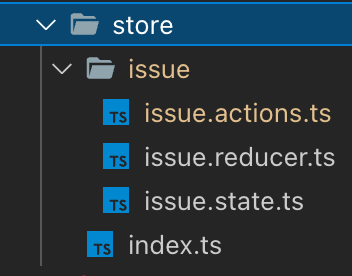
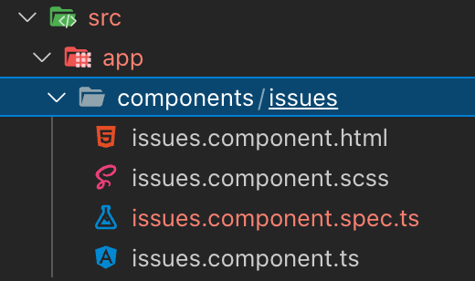
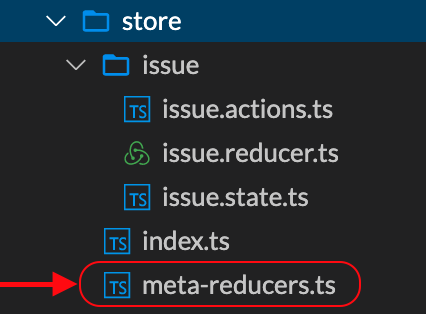

# Ngrx - Issue Tracker Example

<!-- @import "[TOC]" {cmd="toc" depthFrom=1 depthTo=6 orderedList=false} -->

<!-- code_chunk_output -->

- [Ngrx - Issue Tracker Example](#ngrx-issue-tracker-example)
  - [Modifications](#modifications)
    - [`app.module.ts`](#appmodulets)
    - [Store `src/app/store/..`](#store-srcappstore)
      - [`src/app/store/index.ts` &rarr; `actionReducerMap`](#srcappstoreindexts-rarr-actionreducermap)
      - [`src/app/store/issue/issue.actions.ts`](#srcappstoreissueissueactionsts)
      - [`src/app/store/issue/issue.reducer.ts`](#srcappstoreissueissuereducerts)
      - [`src/app/store/issue/issue.state.ts`](#srcappstoreissueissuestatets)
    - [IssuesComponent](#issuescomponent)
      - [`src/app/components/issues/issues.component.html`](#srcappcomponentsissuesissuescomponenthtml)
      - [`src/app/components/issues/issues.component.ts`](#srcappcomponentsissuesissuescomponentts)
    - [Useful information](#useful-information)
      - [Mutable APIs with `immer.js/produce``](#mutable-apis-with-immerjsproduce)
      - [`ngrx-etc`](#ngrx-etc)
      - [`ngrx-wieder`](#ngrx-wieder)
      - [Meta-Reducers](#meta-reducers)

<!-- /code_chunk_output -->

## Modifications

### `app.module.ts`

```ts
// Excerpt

import { StoreModule } from '@ngrx/store';
import { FormsModule, ReactiveFormsModule } from '@angular/forms';
import { actionReducerMap } from './store';
import { StoreDevtoolsModule } from '@ngrx/store-devtools';
import { IssuesComponent } from './components/issues/issues.component';

@NgModule({
  declarations: [AppComponent, IssuesComponent],
  imports: [
    BrowserModule,
    AppRoutingModule,
    FormsModule,
    ReactiveFormsModule,
    StoreModule.forRoot(actionReducerMap),
    StoreDevtoolsModule.instrument({
      maxAge: 25,
      logOnly: environment.production,
    }),
  ],
  providers: [],
  bootstrap: [AppComponent],
})
```

### Store `src/app/store/..`



#### `src/app/store/index.ts` &rarr; `actionReducerMap`

```ts
import { ActionReducerMap } from '@ngrx/store';
import { RootState } from '../static/types';
import { issueReducer } from './issue/issue.reducer';

export const actionReducerMap: ActionReducerMap<RootState> = {
  issue: issueReducer,
};
```

#### `src/app/store/issue/issue.actions.ts`

```ts
import { createAction, props } from '@ngrx/store';
import { Issue } from 'src/app/static/types';

export const submit = createAction(
  '[Issue] Submit',
  props<{ issue: Issue }>(),
);

/*

export declare function props<
  P extends object
>(): ActionCreatorProps<P>;

export interface ActionCreatorProps<T> {
  _as: 'props';
  _p: T;
}

*/
```

#### `src/app/store/issue/issue.reducer.ts`

```ts
import { createReducer, on } from '@ngrx/store';
import { initialState } from './issue.state';
import * as IssueActions from './issue.actions';

export const issueReducer = createReducer(
  initialState,
  on(IssueActions.submit, (state, { issue }) => {
    return {
      ...state,
      entities: {
        ...state.entities,
        [issue.id]: {
          ...issue,
          resolved: false,
        },
      },
    };
  }),
);
```

#### `src/app/store/issue/issue.state.ts`

```ts
export type IssueState = {
  entities: Issues;
  selected: Array<string>;
  filter: Filter;
};

export type Filter = {
  text: string;
};

export const initialState: IssueState = {
  entities: {},
  selected: [],
  filter: { text: '' },
};
```

### IssuesComponent



#### `src/app/components/issues/issues.component.html`

```html
<form [formGroup]="form" (ngSubmit)="submit()">
  Title:
  <input type="text" id="title" formControlName="title" /><br />
  Desc:
  <input
    type="text"
    id="description"
    formControlName="description"
  /><br />
  Prio:
  <select name="priority" id="priority" formControlName="priority">
    <option value="low">Low</option>
    <option value="medium">Medium</option>
    <option value="high">High</option></select
  ><br />
  <button [disabled]="form.invalid">Submit</button>
</form>
```

#### `src/app/components/issues/issues.component.ts`

```ts
import { Component, OnInit } from '@angular/core';
import { FormBuilder, FormGroup, Validators } from '@angular/forms';
import { Store } from '@ngrx/store';
import { RootState } from 'src/app/static/types';
import * as IssueActions from '../../store/issue/issue.actions';

@Component({
  selector: 'app-issues',
  templateUrl: './issues.component.html',
  styleUrls: ['./issues.component.scss'],
})
export class IssuesComponent implements OnInit {
  form: FormGroup;

  constructor(
    private store: Store<RootState>,
    private fb: FormBuilder,
  ) {
    this.form = this.initForm();
  }

  ngOnInit(): void {}

  initForm() {
    return this.fb.group({
      title: ['', Validators.required],
      description: ['', Validators.required],
      priority: ['low', Validators.required],
    });
  }

  submit() {
    const id = this.randomId();
    const issue = { ...this.form.value, id };
    this.store.dispatch(IssueActions.submit({ issue }));
  }

  randomId() {
    return Math.random().toString().substr(2, 9);
  }
}
```

### Useful information

#### Mutable APIs with `immer.js/produce``

`produce`: Instead of modifying the state directly, it allows you to work on a draft of the next state.

```ts
const issue = {
  title: 'Some Title',
  description: 'immer.js example',
  resolved: false,
};

const updatedIssue = produce(issue, (issueDraft) => {
  issueDraft.resolved = true;
});
```

As you can see, `produce()` will eventually return a new object that incorporates the changes made to the draft. This is especially helpful when working with arrays or dictionaries as it decreases the amount of code required for a state transition. Writing and reading code in a mutable fashion also eases the transition into working with `NgRx`. Here’s how our reducer could look with `immer.js`.

Note that we don’t have to return anything from the drafting function while we return the result of `produce()` from the state change function.

```ts
// issue.reducer.ts if mutations desired
import produce from 'immer';
export const issueReducer = createReducer(
  initialState,
  on(IssueActions.submit, (state, { issue }) =>
    produce(state, (draft) => {
      draft.entities[issue.id] = {
        ...issue,
        resolved: false,
      };
    }),
  ),
);
```

#### `ngrx-etc`

If you don’t like to invoke `produce()` in every state change function, take a look at `ngrx-etc` by NgRx team member Tim Deschryver. This library provides replacements for `createReducer()` and `on()` which make the state directly available as a mutable immer draft.

#### `ngrx-wieder`

In addition to providing a convenient way of writing reducers, immer also freezes resulting objects during development in order to prevent unintended mutations at a later point. On top of that, `immer` is able to generate patches documenting any changes to the state. This is what the `ngrx-wieder` library uses to facilitate `undo-redo`.

#### Meta-Reducers

Meta-reducers accept an existing reducer, wrap some logic around it and return a new reducer.



```ts
// meta-reducers.ts
import { ActionReducer, createAction } from '@ngrx/store';

export const loggingMetaReducer = (
  reducer: ActionReducer<any>,
): ActionReducer<any> => {
  return (state, action) => {
    console.log('current state', state);
    console.log('action', action);
    // execute the actual reducer
    const nextState = reducer(state, action);
    console.log('next state', nextState);
    return nextState;
  };
};

export const reset = createAction('Reset');

export const resettingMetaReducer = (
  reducer: ActionReducer<any>,
): ActionReducer<any> => {
  return (state, action) => {
    if (action.type === reset.type) {
      return reducer(undefined, action);
    }
    return reducer(state, action);
  };
};
```

Modified `issue.reducer.ts`

```ts
import { createReducer, on } from '@ngrx/store';
import { initialState } from './issue.state';
import * as IssueActions from './issue.actions';

export const issueReducerOriginal = createReducer(
  initialState,
  on(IssueActions.submit, (state, { issue }) => {
    return {
      ...state,
      entities: {
        ...state.entities,
        [issue.id]: {
          ...issue,
          resolved: false,
        },
      },
    };
  }),
);

export const issueReducer = loggingMetaReducer(issueReducerOriginal);
```
