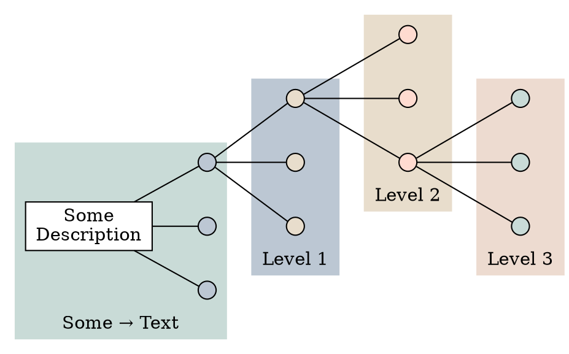

# Example Configuration for Pandoc

> See the *source code of this Markdown file* to see the configuration settings. **Die Reihenfolge im YAML-Block ist sehr wichtig!**

\clearpage

## Introduction

This is an example Markdown configuration file with colored links and highlighted code using JetBrains Mono font[^longnote].

[^longnote]: You have to open this file in a text editor to see the configuration settings.
  BTW: This is a long footnote.

The configuration settings are placed in a so called YAML front matter block at the beginning of the file. The settings are used by the Pandoc document converter to create a PDF file from this Markdown file.

## PDF Generation

If you use assets folder, then better change to the directory, where the markdown file is located and run the following command:

```bash
pandoc ExampleConfig.md \
  --pdf-engine=lualatex \
  --pdf-engine-opt=-shell-escape \
  --lua-filter=graphviz-svg.lua \
  --toc=true \
  --toc-depth=5 \
  --highlight=kate \
  --number-sections \
  -f markdown+emoji+pipe_tables+raw_html \
  --shift-heading-level-by=-1 \
  -s -o ExampleConfig.pdf
```

## Emojis

💣 👀 😇 🤭 💡 ✅ 🏆 💥 ⚠️ 🧨 🎯 🚫 🔑 🔥

- `\alertbig`: \alertbig
- `\texttwemoji{smile}`: \texttwemoji{smile}

You can create custom commands for emojis like this, see [Pandoc/Offical-Documentations/twemojis.pdf](Offical-Documentations/twemojis.pdf).

```yaml
  % Light bulb (idea) - 1f4a1
  \newcommand{\idea}{\twemoji{1f4a1}\space}
  \newcommand{\ideatext}{\texttwemoji{1f4a1}\space}
  \newcommand{\ideabig}{\twemoji[height=2em]{1f4a1}\space}
```

## Highlighted Code

```yaml
highlight:
  - tango       # Current
  - pygments    # Python-style
  - kate        # KDE editor style
  - monochrome  # Black and white
  - espresso    # Dark theme
  - zenburn     # Low contrast dark
  - haddock     # Haskell docs style
  - breezedark  # KDE Breeze dark
  - vs          # Visual Studio style
  - github      # GitHub style
  - monokai     # Sublime Text default
  - dracula     # Dark theme popular in VS Code
```

## Links

Here's a [blue link to Google](https://www.google.com).

## Lists

### Unordered List

- Item 1
  - Subitem 1
    - Subsubitem 1
      - Subsubsubitem 1
      - Subsubsubitem 2
- Item 2
  - Subitem 1
  - Subitem 2
    - Subsubitem 1
- Item 3
  - Subitem 1

### Ordered List

1. Item 1
   1. Subitem 1
      1. Subsubitem 1
         1. Subsubsubitem 1
         2. Subsubsubitem 2
2. Item 2
    1. Subitem 1
    2. Subitem 2
        1. Subsubitem 1
3. Item 3
    1. Subitem 1

### Configuration

```yaml
  \makeatletter
  \renewcommand{\labelitemi}{---}
  \AtBeginDocument{
      \setlist[itemize,enumerate]{
          topsep=0.5em,    % Space before and after the list
      }
  }
  \renewcommand{\tightlist}{
    \setlength{\itemsep}{0.25em}   % Space between items
    \setlength{\parskip}{0.25em}   % Paragraph spacing within items
  }
  \makeatother
```

## Graphviz



## Block Quotes

Here's a block quote:

> This is a block quote.

## Code Highlighting

### Within single backticks

Here's an example `inline code` in JetBrains Mono.

### Python Code

Here's an example of Python code with syntax highlighting in JetBrains Mono:

```python
def greet(name):
```

### TypeScript Code

Here's an example of TypeScript code with syntax highlighting in JetBrains Mono:

```typescript
function greet(name: string): void {
  console.log(`Hello, ${name}!`);
}
```

### Bash & Shell

And here's some bash code:

```bash
# bash code
echo "Hello, World!"
for i in {1..5}
do
   echo "Count: $i"
done
```

## Nested Headings

### Third Level

Some third level text.

#### Fourth Level

Some fourth level text.

##### Fifth Level

Some fifth level text.

## Ditaa

[https://github.com/stathissideris/ditaa](https://github.com/stathissideris/ditaa)

```ditaa {kroki=true}
+--------+   +-------+    +--------+
|        +---+ ditaa +--->*        |
|  Text  |   +-------+    |diagram |
|Document|   |!magic!|    |        |
|     {d}|   |       |    |        |
+-+-+----+   +-------+    +------+-+
  |  :                         ^ |
  |  |       Lots of work      | |
  |  +-------------------------+ |
  \------------------------------/

+---------+  /--------\   +-------+
| cBLU    +--+cAAA    +---+Version|
|         |  |  Data  |   |   V3  |
|    +----+  |  Base  |   |cRED{d}|
|    |cPNK|  |     {s}|   +-------+
|    |    |  \---+----/
+----+----+

/--+
|  |
+--/

+-----+ +-----+ +-----+ +-----+ +-----*-----+
|{d}  | |{s}  | |{io} | |{o}  | |{c}        |
|     | |     | |     | |     | *   yes/no  *
|     | |     | |     | |     | |           |
+-----+ +-----+ +-----+ +-----+ +-----*-----+

*----*
|    |      /--*
*    *      |
|    |  -*--+
*----*

/-----------------\
| Things to do    |
| cGRE            |
| - Cut the grass |
| - Buy jam       |
| - Fix car       |
| - Make website  |
\-----------------/


```

## TODOs

### Experiment with Fontsizes

```yaml
\usepackage{anyfontsize}
\fontsize{13pt}{15.6pt}\selectfont
```
