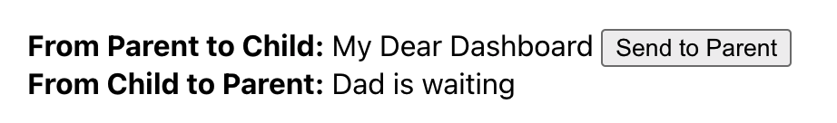
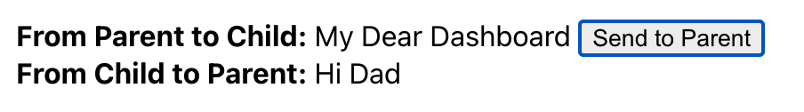

# Revisiting React v17+

<!-- @import "[TOC]" {cmd="toc" depthFrom=2 depthTo=6 orderedList=false} -->

<!-- code_chunk_output -->

- [Important keywords at the beginning](#important-keywords-at-the-beginning)
- [Creating a React App via CLI](#creating-a-react-app-via-cli)
  - [Create React App &rarr; Templates](#create-react-app-rarr-templates)
  - [Selecting a Package Manager](#selecting-a-package-manager)
- [Default `app.tsx` file content](#default-apptsx-file-content)
  - [First Impressions](#first-impressions)
    - [Overview](#overview)
    - [Minimal possible version](#minimal-possible-version)
      - [Return Type String is not allowed](#return-type-string-is-not-allowed)
      - [Only One Single Wrapping Element](#only-one-single-wrapping-element)
    - [index.ts](#indexts)
- [Generating a New Component](#generating-a-new-component)
  - ['generate-react-cli'](#generate-react-cli)
    - [Generated Files](#generated-files)
      - [Dashboard.lazy.tsx](#dashboardlazytsx)
      - [Dashboard.module.scss](#dashboardmodulescss)
      - [Dashboard.stories.tsx](#dashboardstoriestsx)
      - [Dashboard.test.tx](#dashboardtesttx)
      - [Dashboard.tsx](#dashboardtsx)
- [Basic Examples](#basic-examples)
  - [Object.getOwnPropertyNames(React)](#objectgetownpropertynamesreact)
  - [React.useState()](#reactusestate)
    - [Simple Counter](#simple-counter)
    - [One](#one)
    - [Two](#two)
  - [Data Exchange between Components](#data-exchange-between-components)
    - [Parent to Child](#parent-to-child)
      - [Parent e.g. App.tsx](#parent-eg-apptsx)
      - [Child e.g. Dashboard.tsx](#child-eg-dashboardtsx)
    - [Child to Parent](#child-to-parent)
      - [Parent, e.g. App.tsx](#parent-eg-apptsx-1)
      - [Child, e.g. Dashboard.tsx](#child-eg-dashboardtsx-1)
      - [Types](#types)

<!-- /code_chunk_output -->

## Important keywords at the beginning

- UI as a function
- React Component = UI + Logic
- No Double-Binding in React
- Props or States (More on that later)
- Hooks-API (from v16.8) - Functional Style
- Rich Eco-System (More on that later)
  - Flux (Avoid &rarr; State mutable)
  - Redux (better than Flux, Angular compatible, Immutable)
  - React Router
  - React Native

## Creating a React App via CLI

Install `create-react-app` & use it:

```shell
npm i -g create-react-app
create-react-app my-app-name --template typescript
cd my-app-name
npm start
```

### Create React App &rarr; Templates

Basic Syntax:

```shell
npx create-react-app my-app --template [template-name]
```

You can find a list of available templates by searching for ["cra-template-\*"](https://www.npmjs.com/search?q=cra-template-*) on npm.

Some of them:

```shell
create-react-app my-app --template cypress # JS not TSX!
create-react-app my-app --template pwa
create-react-app --scripts-version universal-scripts my-app
```

### Selecting a Package Manager

When you create a new app, the CLI will use Yarn to install dependencies (when available). If you have Yarn installed, but would prefer to use npm, you can append `--use-npm` to the creation command. For example:

```shell
npx create-react-app my-app --use-npm
```

## Default `app.tsx` file content

```tsx
import React from 'react';
import logo from './logo.svg';
import './App.css';

function App() {
  return (
    <div className="App">
      <header className="App-header">
        
        <p>
          Edit <code>src/App.tsx</code> and save to reload.
        </p>
        <a
          className="App-link"
          href="https://reactjs.org"
          target="_blank"
          rel="noopener noreferrer"
        >
          Learn React
        </a>
      </header>
    </div>
  );
}

export default App;
```

### First Impressions

#### Overview

```tsx
1) import SVG and CSS
2) function App () { return (); }
2.1) return () contains HTML
2.2) css class is -> className
2.3) Hello World!</div>;
}
```

##### Return Type String is not allowed

The following would not work:

```tsx
export default function App() {
  return 'Hello World!';
}
```

outputs:

```shell
'App' cannot be used as a JSX component.
  Its return type 'string' is not a valid JSX element.
```

##### Only One Single Wrapping Element

The following would not work:

```tsx
export default function App() {
  return (<div>Hello World One!</div><div>Hello World Two!</div>);
}
```

outputs:

```shell
Adjacent JSX elements must be wrapped in an enclosing tag.
```

#### index.ts

```tsx
import React from 'react';
import ReactDOM from 'react-dom';
import './index.css';
import App from './App';
import reportWebVitals from './reportWebVitals';

ReactDOM.render(
  <React.StrictMode>
    <App />
  </React.StrictMode>,
  document.getElementById('root'),
);

// If you want to start measuring performance in your app, pass a function
// to log results (for example: reportWebVitals(console.log))
// or send to an analytics endpoint. Learn more: https://bit.ly/CRA-vitals
reportWebVitals();
```

## Generating a New Component

### 'generate-react-cli'

> Installing it globally has no implications, therefore use `npx`
> You can use StoryBook, if so: `yarn add @storybook/react`
> StoryBook &rarr; More on that later
> install also `yarn add node-sass`

```shell
npx generate-react-cli component Dashboard
```

If it is the first time, CLI will create a configuration file `generate-react-cli.json` at the project's root.

```shell
? Does this project use TypeScript? Yes
? Does this project use CSS modules? Yes
? Does this project use a CSS Preprocessor? scss
? What testing library does your project use? Enzyme
? Set the default path directory..? src/components
? .. create a CSS File  ..? Yes (SCSS)
? .. create a corresponding test file ..? Yes
? .. create a corresponding story ..? Yes
? .. create a corresponding lazy file .. ? Yes
```

> Important: the newly created component must be within the `src` folder. If you want to create a certain directory for all your components e.g. `compontents/MyComponent` set `src/components` in your `generate-react-cli.json` file, like:

```json
  "component": {
    "default": {
      "path": "src/components",
      ...
```

> See more on lazy files: <https://reactjs.org/docs/code-splitting.html#code-splitting>

#### Generated Files

##### Dashboard.lazy.tsx

```tsx
import React, { lazy, Suspense } from 'react';

const LazyDashboard = lazy(() => import('./Dashboard'));

const Dashboard = (
  props: JSX.IntrinsicAttributes & { children?: React.ReactNode },
) => (
  <Suspense fallback={null}>
    <LazyDashboard {...props} />
  </Suspense>
);

export default Dashboard;
```

##### Dashboard.module.scss

```css
.Dashboard {
}
```

##### Dashboard.stories.tsx

```tsx
/* eslint-disable */
import React from 'react';
import { storiesOf } from '@storybook/react';
import Dashboard from './Dashboard';

storiesOf('Dashboard', module).add('default', () => <Dashboard />);
```

##### Dashboard.test.tx

> Enzyme is the only available option via this CLI but
> you change it within `generate-react-cli.json` to `Jest`

```tsx
import React from 'react';
import { shallow } from 'enzyme';
import Dashboard from './Dashboard';

describe('<Dashboard />', () => {
  let component;

  beforeEach(() => {
    component = shallow(<Dashboard />);
  });

  test('It should mount', () => {
    expect(component.length).toBe(1);
  });
});
```

##### Dashboard.tsx

```tsx
import React from 'react';
import styles from './Dashboard.module.scss';

const Dashboard: React.FC = () => (
  <div className={styles.Dashboard}>Dashboard Component</div>
);

export default Dashboard;
```

## Basic Examples

### Object.getOwnPropertyNames(React)

```js
[
  'Children',
  'cloneElement',
  'Component',
  'createContext',
  'createElement',
  'createFactory',
  'createRef',
  'forwardRef',
  'Fragment',
  'isValidElement',
  'lazy',
  'memo',
  'Profiler',
  'PureComponent',
  'StrictMode',
  'Suspense',
  'useCallback', // React Hooks begin with -> use..
  'useContext',
  'useDebugValue',
  'useEffect',
  'useImperativeHandle',
  'useLayoutEffect',
  'useMemo',
  'useReducer',
  'useRef',
  'useState',
  'version',
  '__SECRET_INTERNALS_DO_NOT_USE_OR_YOU_WILL_BE_FIRED',
];
```

### React.useState()

> Basic Use: `const [state, setState] = useState(initialState)`
> a: `string`, setA: `React.Dispatch<React.SetStateAction<string>>`

```tsx
import React from 'react';
export default function App() {
  const [a, setA] = React.useState('');

  function logClick() {
    console.log('A:', a);
  }

  return (
    <div>
      <input value={a} onChange={(e) => setA(e.target.value)} />
      <button onClick={logClick}>Log</button>
      <br />
      A: {a}
    </div>
  );
}
```

#### Simple Counter

#### One

```tsx
import React from 'react';
export default function App() {
  const [count, setCount] = React.useState(0);
  let a = count;

  return (
    <div>
      Count: {count} <br />
      <button onClick={() => setCount(++a)}>Increment</button>
    </div>
  );
}
```

#### Two

```tsx
import React from 'react';
export default function App() {
  const [count, setCount] = React.useState(0);
  // Without variable a
  return (
    <div>
      Count: {count} <br />
      <button onClick={() => setCount(count + 1)}>Increment</button>
    </div>
  );
}
```

### Data Exchange between Components

#### Parent to Child

##### Parent e.g. App.tsx

```tsx
import Dashboard from './components/Dashboard/Dashboard';
export default function App() {
  return <Dashboard title="My Dashboard"></Dashboard>;
}
```

##### Child e.g. Dashboard.tsx

```tsx
import React from 'react';

export type DashboardProps = {
  title: string;
};

const Dashboard: React.FC<DashboardProps> = (props) => (
  <div>Dashboard Component {props.title}</div>
);

export default Dashboard;
```

is the same as above (excerpt):

```tsx
export default function Dashboard(props: DashboardProps) {
  return <div>Dashboard Component {props.title}</div>;
}
```

#### Child to Parent




##### Parent, e.g. App.tsx

```tsx
import React from 'react';
import Dashboard from './components/Dashboard/Dashboard';
export default function App() {
  const [messageFromChild, getMessageFromChild] = React.useState(
    'Dad is waiting',
  );

  const sendDataToParent = (message: string) => {
    getMessageFromChild(message);
  };
  return (
    <div>
      <Dashboard
        props={{ title: 'My Dear Dashboard' }}
        sendDataToParent={sendDataToParent}
      ></Dashboard>
      <div>
        <strong>From Child to Parent:</strong> {messageFromChild}
      </div>
    </div>
  );
}
```

##### Child, e.g. Dashboard.tsx

```tsx
import React from 'react';
import { DashboardProps } from '../../Types';
import styles from './Dashboard.module.scss';

const Dashboard: React.FC<DashboardProps> = ({
  props,
  sendDataToParent,
}) => (
  <div className={styles.Dashboard}>
    <strong>From Parent to Child:</strong> {props.title}
    &nbsp;
    <button
      onClick={() => {
        sendDataToParent('Hi Dad');
      }}
    >
      Send to Parent
    </button>
  </div>
);

export default Dashboard;
```

##### Types

```tsx
export type DashboardProps = {
  props: {
    title: string;
  };
  sendDataToParent: (message: string) => void;
};
```
