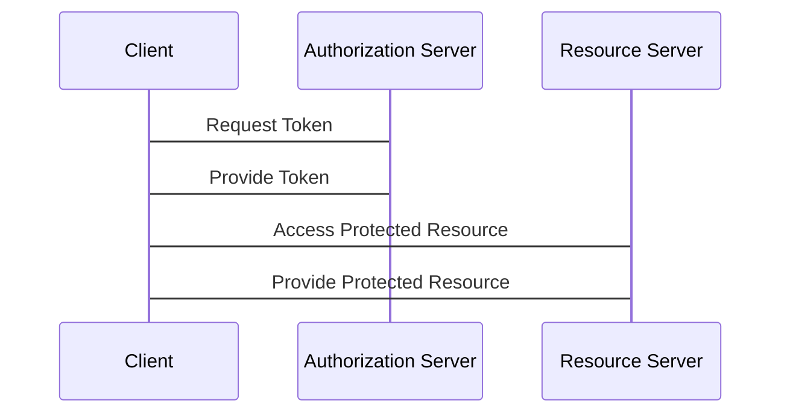
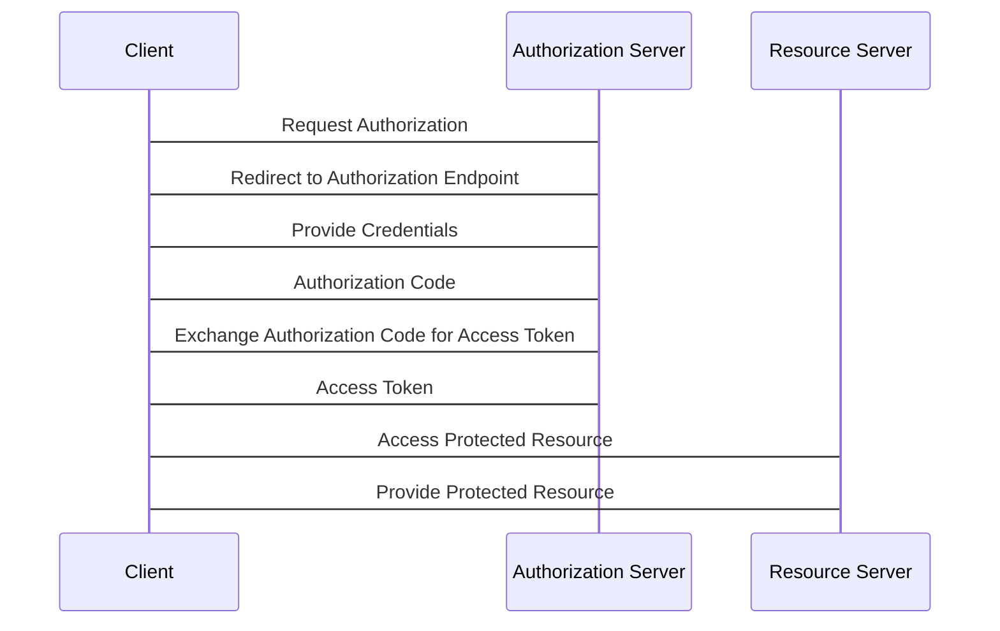
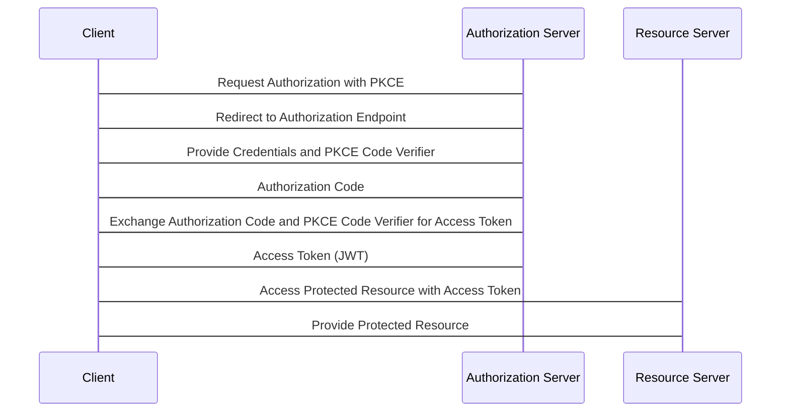
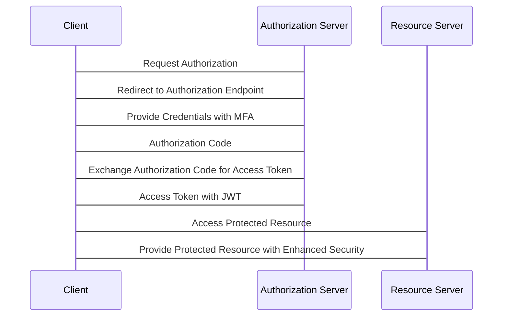

# OAuth

<!-- @import "[TOC]" {cmd="toc" depthFrom=2 depthTo=6 orderedList=false} -->

<!-- code_chunk_output -->

- [Sources](#sources)
  - [Documents](#documents)
  - [Whimsical Online Diagram Editor](#whimsical-online-diagram-editor)
- [v1.0](#v10)
- [v2.0](#v20)
- [v2.1 (In Progress)](#v21-in-progress)
- [v3.0 (Hypothetical)](#v30-hypothetical)
- [Glossar](#glossar)

<!-- /code_chunk_output -->

## Sources

### Documents

- [OAuth v2.0: https://oauth.net/2/](https://oauth.net/2/)
- [OAuth v2.1: https://oauth.net/2.1/](https://oauth.net/2.1/) (Still in Progress)

### Whimsical Online Diagram Editor

- [OAuth v2.0](https://whimsical.com/oauth-2-0-flow-E6nZrsrE7FrhTJEpqGuBXp)
- [OAuth v2.1](https://whimsical.com/oauth-2-1-flow-H971xpurNoQZJQwHHpmgrk)

## v1.0

## v2.0

## v2.1 (In Progress)

## v3.0 (Hypothetical)

## Glossar

- **PKEC**: Proof Key for Code Exchange
- **MFA**: Multi-Factor Authentication
- **JWT**: JSON Web Token
