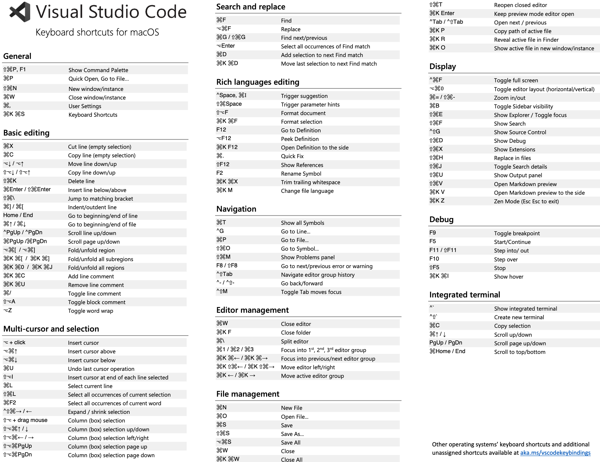

# VSCode

> Status: Under Construction

<!-- @import "[TOC]" {cmd="toc" depthFrom=2 depthTo=5 orderedList=false} -->

<!-- code_chunk_output -->

- [Getting Started](#getting-started)
  - [Shortcuts](#shortcuts)
    - [Secondary Bar](#secondary-bar)
    - [Quick Open](#quick-open)
    - [Editing](#editing)
      - [Side by Side Editing](#side-by-side-editing)
      - [Multi-Cursor Editing](#multi-cursor-editing)
  - [Excluding Folders](#excluding-folders)
  - [Shortcuts Overview (Image)](#shortcuts-overview-image)
    - [MacOS](#macos)
    - [Windows](#windows)
- [Trouble Shooting](#trouble-shooting)
  - [Remove VSCode from MacOS Completely](#remove-vscode-from-macos-completely)
  - [Export/Import Extensions](#exportimport-extensions)
  - [Unknown SCSS Properties](#unknown-scss-properties)
  - [Fixing JSON (Search and Replace)](#fixing-json-search-and-replace)
    - [Replace blank spaces with underscores in JSON Keys](#replace-blank-spaces-with-underscores-in-json-keys)
    - [Add Missing Commas Between Objects in an JSON Array](#add-missing-commas-between-objects-in-an-json-array)
    - [Every Object is embedded in an Array and commas are missing too.](#every-object-is-embedded-in-an-array-and-commas-are-missing-too)

<!-- /code_chunk_output -->

## Getting Started


### Shortcuts

#### Secondary Bar

```plaintext
Show: ⌥ ⌘ B
Toggle: ⌘ B
```

#### Quick Open

```plaintext
Quick Open: ⌘ P
Quick Open Symbols: ⌘ T
Command Palette: ⇧ ⌘ P
```

#### Editing

##### Side by Side Editing

```plaintext
Split active Editor:      ⌘ \           Editor
Open to the Side:         ⌥ + Click     File in Explorer
```

##### Multi-Cursor Editing

```plaintext
Add Cursor                    ⌥ + Click
Add Cursor to Next Line:      ⌥ ⌘ ↓
Add Cursor to Previous Line:  ⌥ ⌘ ↑
Add Cursor Above:             ⇧ ⌥ ↑
Add Cursor Below:             ⇧ ⌥ ↓
Add Cursor to Line Ends:      ⇧ ⌘ L
Add Next Occurrence:          ⌘ D
Add All Occurrences:          ⌘ ⇧ L
```

### Excluding Folders

By default, VS Code excludes some folders from the Explorer (for example. `.git`). Use the `files.exclude` [setting](https://code.visualstudio.com/docs/getstarted/settings) to configure rules for hiding files and folders from the Explorer.

**Tip:** This is really useful to hide derived resources files, like `\*.meta` in Unity, or `\*.js` in a TypeScript project. For Unity to exclude the `\*.cs.meta` files, the pattern to choose would be: `"**/*.cs.meta": true`. For TypeScript, you can exclude generated JavaScript for TypeScript files with: `"**/*.js": {"when": "$(basename).ts"}`.

### Shortcuts Overview (Image)

#### MacOS



#### Windows


## Trouble Shooting

### Remove VSCode from MacOS Completely

```shell
rm -fr ~/Library/Preferences/com.microsoft.VSCode.helper.plist
rm -fr ~/Library/Preferences/com.microsoft.VSCode.plist
rm -fr ~/Library/Caches/com.microsoft.VSCode
rm -fr ~/Library/Caches/com.microsoft.VSCode.ShipIt/
rm -fr ~/Library/Application\ Support/Code/
rm -fr ~/Library/Saved\ Application\ State/com.microsoft.VSCode.savedState/
rm -fr ~/.vscode/
```

### Export/Import Extensions

```shell
code --list-extensions > extensions-list.txt
cat extensions-list.txt | xargs -L 1 code --install-extension
```

### Unknown SCSS Properties

Update your workspace settings to include the following:

```json
{
  "css.lint.validProperties": ["rx", "ry", "cx", "cy", "r"],
  "scss.lint.validProperties": ["rx", "ry", "cx", "cy", "r"],
}
```

### Fixing JSON (Search and Replace)

#### Replace blank spaces with underscores in JSON Keys

Find: `("[^"\n]*?)\s([^"\n]*?":)` and replace with `$1_$2`. You have to repeat this operation until all blank spaces are replaced with underscores.

```json
{
  "key with blank spaces": "value",
  "another key with blank spaces": "value"
}
```

#### Add Missing Commas Between Objects in an JSON Array

Search for: `\}[\s\n\r]*\{` and replace with `},\n{`.

```plaintext
// Before:
[{"key": "value"}{"key": "value"}]

// After:
[{"key": "value"},{"key": "value"}]
```

**Search Pattern explanation:**

```plaintext

}              - Closing curly brace of a JSON object
[\s\n\r]       - Any whitespace characters (spaces, tabs, line breaks)
*              - Zero or more of the previous characters
{              - Opening curly brace of the next object

Replace Pattern explanation:
},             - Closing brace followed by a comma
\n             - Line break for better readability
{              - Opening brace of the next object
```

#### Every Object is embedded in an Array and commas are missing too.

Following situation:

```plaintext
// Example before:
[{"id": 1}]
[{"id": 2}]
[{"id": 3}]

// Example after:
[
  {"id": 1},
  {"id": 2},
  {"id": 3}
]
```

Search for `\](\s*\r*\n*)\[` and replace with `,\n`. Everything between opening and closing square brackets will be replaced with a comma and a line break.
