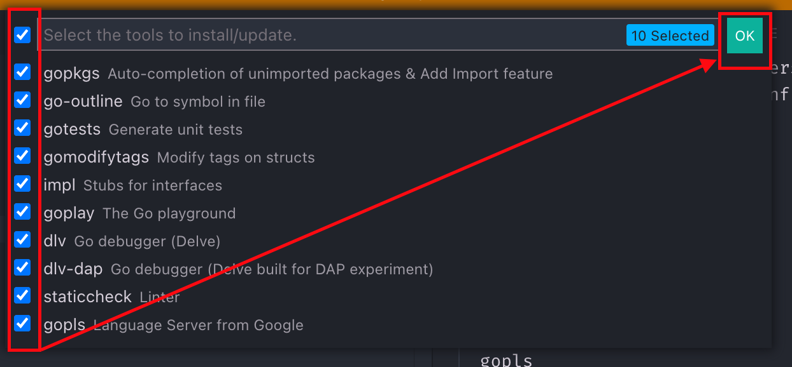

# GoLang

<!-- @import "[TOC]" {cmd="toc" depthFrom=2 depthTo=6 orderedList=false} -->

<!-- code_chunk_output -->

- [Getting Started](#getting-started)
  - [Install Go via Brew](#install-go-via-brew)
  - [Uninstall Go](#uninstall-go)
    - [If previously installed via Brew](#if-previously-installed-via-brew)
    - [If previously installed via Pkgutil](#if-previously-installed-via-pkgutil)
  - [Go Versions Manager](#go-versions-manager)
    - [Installing](#installing)
    - [ENV VARIABLES (Important for VSCode)](#env-variables-important-for-vscode)
  - [VsCode Install/Update Tools](#vscode-installupdate-tools)
    - [Go Ppkgs](#go-ppkgs)
    - [Go Outline](#go-outline)
    - [Go Tests](#go-tests)
    - [Go Modify Tags](#go-modify-tags)
    - [Go Impl](#go-impl)
    - [Go Play Ground Client](#go-play-ground-client)
    - [Go Delve](#go-delve)
    - [Go Tools from Dominik Honnef: Go `staticcheck`](#go-tools-from-dominik-honnef-go-staticcheck)
    - [gopls, the Go Language Server](#gopls-the-go-language-server)

<!-- /code_chunk_output -->

## Getting Started

### Install Go via Brew

```shell
brew install go
```

### Uninstall Go

Online: <https://blog.dharnitski.com/2019/04/06/uninstall-go-on-mac/>

##### If previously installed via Brew

```shell
brew uninstall dep
brew uninstall go
```

##### If previously installed via Pkgutil

```shell
pkgutil --pkgs | grep go   # find in the list
sudo pkgutil --forget org.golang.go
```

### Go Versions Manager

Online: <https://github.com/kevincobain2000/gobrew>

##### Installing

```shell
curl -sLk https://git.io/gobrew | sh -  # Installation
gobrew use 1.16.4 # Download, install and use in one step

gobrew install 1.16.4  # install only
gobrew use 1.16.4 # change to this version

go uninstall 1.16 # uninstall a certain version
```

##### ENV VARIABLES (Important for VSCode)

VSCode needs GOPATH and GOBIN to detect the currently used version,
if e.g. a package manager like gobrew is installed:

```shell
# ~/.zshrc excerpt

export PATH="$HOME/.gobrew/current/bin:$HOME/.gobrew/bin:$PATH"
export GOPATH="$HOME/.gobrew/current"
export GOBIN="$HOME/.gobrew/current/bin"
```

### VsCode Install/Update Tools

> **Notice**: You have to repeat this step if you use a go versions manager and
> and change the current version!

1. F1 -> Go: Install/Update Tools
2. Select all and click OK



You see then in output window, something like:

```shell

Installing 10 tools at the configured GOBIN:
  gopkgs
  go-outline
  gotests
  gomodifytags
  impl
  goplay
  dlv
  dlv-dap
  staticcheck
  gopls
```

More information to the tools online:

##### Go Ppkgs

`gopkgs` is a tool that provides list of available Go packages that can be imported. This is an alternative to `go list all`, just faster.

Online: <https://github.com/uudashr/gopkgs/>

##### Go Outline

Simple utility for extracting a JSON representation of the declarations in a Go source file.

<https://github.com/ramya-rao-a/go-outline>

##### Go Tests

`gotests` makes writing Go tests easy. It's a Golang commandline tool that generates table driven tests based on its target source files' function and method signatures. Any new dependencies in the test files are automatically imported.

<https://github.com/cweill/gotests/>

##### Go Modify Tags

Go tool to modify/update field tags in structs. `gomodifytags` makes it easy to update, add or delete the tags in a struct field. You can easily add new tags, update existing tags (such as appending a new key, i.e: db, xml, etc..) or remove existing tags. It also allows you to add and remove tag options. It's intended to be used by an editor, but also has modes to run it from the terminal. Read the usage section below for more information.


<https://www.github.com/fatih/gomodifytags>

##### Go Impl

`impl` generates method stubs for implementing an interface.

```go
$ impl 'f *File' io.ReadWriteCloser
func (f *File) Read(p []byte) (n int, err error) {
	panic("not implemented")
}

func (f *File) Write(p []byte) (n int, err error) {
	panic("not implemented")
}

func (f *File) Close() error {
	panic("not implemented")
}

# You can also provide a full name by specifying the package path.
# This helps in cases where the interface can't be guessed
# just from the package name and interface name.
$ impl 's *Source' golang.org/x/oauth2.TokenSource
func (s *Source) Token() (*oauth2.Token, error) {
    panic("not implemented")
}
```

<https://www.github.com/josharian/impl>

##### Go Play Ground Client

```shell
goplay some-example.go # opens browser
```

<https://www.github.com/haya14busa/goplay/>

##### Go Delve

A Debugger for the Go Programming Language

GitHub: <https://www.github.com/go-delve/delve/>
Getting Started: <https://github.com/go-delve/delve/blob/master/Documentation/cli/getting_started.md>

##### Go Tools from Dominik Honnef: Go `staticcheck`

`Staticcheck` is a state of the art linter for the Go programming language. Using static analysis, it finds bugs and performance issues, offers simplifications, and enforces style rules.

GitHub: <https://github.com/dominikh/go-tools>
Online Documentation: <https://staticcheck.io/docs/>

##### gopls, the Go Language Server

`gopls` (pronounced "Go please") is the official Go language server developed by the Go team. It provides IDE features to any LSP-compatible editor.

You should not need to interact with gopls directly--it will be automatically integrated into your editor.

<https://pkg.go.dev/golang.org/x/tools/gopls>

<https://www.golang.org/x/tools/gopls>

## Basics
